# Daily Knowledge

## Day 5

### Feature Engineering

#### Time Feature: Sine & Cosine

- If we express each timestamp of the day into number of seconds, the number of seconds simply increases linearly with time and we will lose the cyclical behavior of time.
- Solution: to apply sine & cosine transformations to recover the cyclical behavior of time.
- Why we need both sine & consine transformations ?
  - With a single sine transformation, 12 p.m. is equivalent to 12 a.m., and 5 p.m. is equivalent to 5 a.m. This is undesired, as we want to distinguish between morning and afternoon.
  - Cosine is out of phase with the sine function. This allows us to distinguish between 5 a.m. and 5 p.m.

### Confidence Intervals of the predictions

- SARIMAX provides the confidence intervals of predictions in `get_prediction` mehtod.

```Python
# Fit the SARIMAX model
model = SARIMAX(train, order=(1, 1, 1), seasonal_order=(1, 1, 1, 12))
fitted_model = model.fit()

# Forecast the next 10 steps
forecast = fitted_model.get_prediction(steps=10, exog=exog_test)
forecast_values = forecast.predicted_mean # prediction value
forecast_ci = forecast.conf_int()         # confidence interval (lower, upper)


fig = go.Figure()
fig.add_trace(go.Scatter(x=df[-15:].Month, y=df[-15:]['Passengers'], name='actual', line = dict(color='royalblue')))

fig.add_trace(go.Scatter(x=test.Month, y=test[pred_type], name='pred', line = dict(dash='dash')))
fig.add_trace(go.Scatter(x=test.Month, y=forecast_ci["lower"],
    fill=None,
    mode='lines',
    showlegend = False,
    line_color='rgba(0,0,0,0)',
    ))
fig.add_trace(go.Scatter(x=test.Month, y=forecast_ci["lower"],
    fill='tonexty', # fill area between trace0 and trace1
    name="Confidence Interval - SARIMA_pred_rolling",
    mode='lines', line_color='rgba(0,0,0,0)', fillcolor = 'rgba(255, 0, 0, 0.2)'))

fig.update_layout(
    yaxis_title='Month',
    xaxis_title='Number of air passenggers',
    title='Prediction on Test Set'
)
fig.show()
```

## Day 4

- White noise: uncorrelated (Ljung-Box test) & normally distributed (use Q-Q plot to compare white noise with the theoretical _normal_ distribution)
- **Residuals** of a model are simply the difference between the predicted values and the actual values.

### Quantile Quantile (Q-Q) plots

- The quantile-quantile (Q-Q) plot is a graphical method for determining if a dataset follows a certain probability distribution or whether two samples of data came from the same population or not.
  - Q-Q plots are particularly useful for assessing whether a dataset is normally distributed or if it follows some other known distribution.

```Python

import numpy as np
import matplotlib.pyplot as plt
import scipy.stats as stats

# Generate example of normal distribution data
np.random.seed(0)
data = np.random.normal(loc=0, scale=1, size=1000)

# Create Q-Q plot
stats.probplot(data, dist="norm", plot=plt)
plt.title('Normal Q-Q plot')
plt.xlabel('Theoretical quantiles')
plt.ylabel('Ordered Values')
plt.grid(True)
plt.show()
```

| Q-Q plot of a dataset that is very close to a normal distribution |    Q-Q plot of a dataset that is not close to a normal distribution.     |
| :---------------------------------------------------------------: | :----------------------------------------------------------------------: |
|   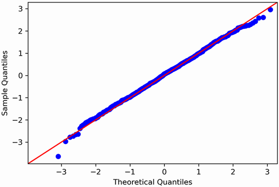    | 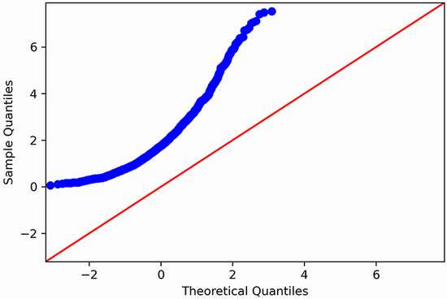 |

- The Q-Q plot is constructed by plotting the quantiles of our residuals on the y-axis against the quantiles of a theoretical distribution, in this case the normal distribution, on the x-axis.
  - If both distributions are similar, meaning that the distribution of the residuals is close to a normal distribution, the Q-Q plot will display a straight line that approximately lies on $y = x$.
  - If both distributions are not similar, meaning that the distribution of the residuals is not close to a normal distribution, the Q-Q plot will generate the curve that departs from $y = x$.

## Day 3

### Approach to time-series forecasting problems

#### Forecasting stationary series

- **Note**: The below models only can be used for **stationary** time series, or those non-stationary series which require only **one round** of transformations, mainly differencing to make it stationary. The forecasts from each model _returned differenced values_, which required us to reverse this transformation in order to bring the values back to the scale of the original data.
- **Step 1**: Check if the time-series is random walk process where its **first difference** is **stationary** (using ADF, KPSS test) & **no autocorrelation** (i.e.: ACF will show no significant coefficients after lag 0)
  - If yes, using [naive forecasting methods](#baseline-models-naive-for-time-series) as we cannot model the random process. Else, move to Step 2.
  - Note on Stationary: if we can observe a trend over the time,the time-series is not stationary, so we will have to apply a transformation in order to make it stationary.
  - Note on Seasonality: if there is no cyclical pattern, so we can rule out the presence of seasonality.
- **Step 2**: If the time-series achieves the **stationary** after transformation (differencing), and its differenced series exhibits **autocorrelation**.
  - In this case, the time series can be approximated by
    - **Moving Average $MA(q)$ model**: the present value is linearly dependent on current and past error terms.
      - The order of a stationary $MA(q)$ process is determined by the `ACF` plot: the autocorrelation coefficients will be significant up until lag $q$.
        - If the autocorrelation coefficients in `ACF` _slowly decay_ or exhibit a _sinusoidal_ pattern, then you are possibly in the presence of an **autoregressive** process.
    - **Autoregressive $AR(p)$ model**: the process where the present value $y_t$ is linearly dependent on its past values from $y_{t–1}$ to $y_{t–p}$.
      - The order $p$ of a stationary $AR(p)$ process is determined using the `PACF` plot to determine: the **coefficients will be non-significant** after lag $p$.
    - **Autoregressive Moving Average $ARMA(p,q)$ model** is the combination of the autoregressive model $AR(p)$ and the moving average model $MA(q)$.
      - An ARMA(p,q) process will display a **decaying pattern** or a **sinusoidal** pattern on _both the ACF and PACF_ plots.
      - Therefore, they cannot be used to estimate the orders $p$ and $q$.
      - As using the ACF and PACF plots to determine the orders $q$ and $p$, respectively, becomes difficult, **general modeling procedure** is required to determine the optimal combination of $p$ and $q$ for our series.

#### Forecasting non-stationary series

- We can forecast **non-stationary** time series & avoid the steps of modeling on stationary (differenced) data and having to inverse transform the forecasts by adding the **integration order** component ($d >= 2$), which is denoted by the variable $d$ into the $ARMA(p,q)$ model
- **Autoregressive Integrated Moving Average $ARIMA(p,d,q)$ model**
  - Step 1: EDA (stationary) to identify $d$ how many times the differencing requires to be stationary, usually $d >=2$, so we can skip ACF, PACF plots as ARIMA model does not rely on those plots to deterime `p` and `q`.
    - Note: perform _time series decomposition_ to identify seasonal patterns
      - If there is no seasonal patterns in the series, proceed to Step 2. Else, please refer to SARIMA models
  - Step 2: Use **general modeling procedure** to determine the optimal combination of $p$ and $q$ with the fixed $d$ identified in Step 1.
- **Seasonal Autoregressive Integrated Moving Average $SARIMA(p,d,q)(P,D,Q)_m$ model** which allows us to model **non-stationary** **seasonal** time series.
- :star: The $\text{SARIMAX}$ model further extends the $\text{SARIMA}(p,d,q)(P,D,Q)_m$ model by adding the effect of exogenous variables $X$.
  - The SARIMAX model is the **most general model** for forecasting time series.

#### Random Walk

- There are instances where the simplest (naive forecasting) methods will yield the best forecasts in compared with sophisticated methods such as statistical or deep learning models. This is the case when we face a **random walk** process.
- A `random walk` is a sequence where the **first difference** is **not autocorrelated** (i.e.: ACF will show no significant coefficients after lag 0) and is a **stationary** process, meaning that its mean, variance, and autocorrelation are constant over time.

  - Because a random process takes random steps into the future, we **cannot use statistical or deep learning** techniques to fit such a process: there is **nothing to learn from randomness** and it cannot be predicted. Instead, we must **rely on [naive forecasting methods](#baseline-models-naive-for-time-series)**.

  <p align="center">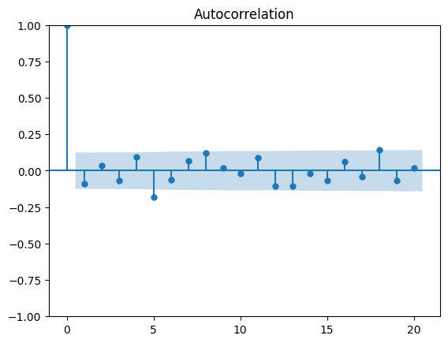<br>There are no significant coefficients after lag 0 in the ACF plot</p>

  - The shaded area represents a confidence interval.
    - If a point is within the shaded area, then it is not significantly
    - Otherwise, the autocorrelation coefficient is significant.

- If the process is not a random walk, so it can be approximated by the moving average (MA) model, an autoregressive (AR) model, or the combination of both processes, leading to an autoregressive moving average (ARMA) model.

#### Moving Average (MA) Process

- Defining a moving average process $MA(q)$: expresses the present value as a linear combination of
  - The **mean** of the series ($\mu$)
  - The _current_ ($\epsilon_t$) & _past_ ($\epsilon_{t-q}$) **error terms**
    - Those error terms are assumed to be _mutually independent_ and _normally distributed_, just like white noise.
    - The _magnitude of the impact_ of **past errors on the present value** is quantified using a coefficient denoted as ($\theta_q$).
      $$y_t = \mu + \epsilon_t + \theta_1\epsilon_{t-1} + ... + \theta_q\epsilon_{t-q}$$
  - Note 1: The order $q$ of the moving average model determines the number of past error terms that affect the present value.
- Checking stationary & using the ACF to identify the order of a moving average process
<p align="center">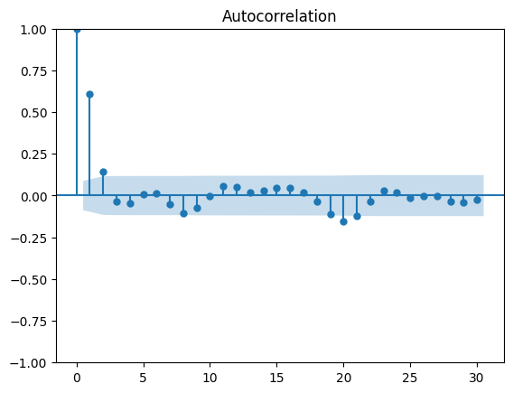<br>ACF Plot of The Differenced Time Series of MA(2)</p>

- Forecasting a time series using the moving average model
  - _Note 1_: MA model assumes stationarity, so if the process is not stationary, the model has to be trained and testes on its stationary **differenced series**
  - _Note 2_: $MA(q)$ model can only forecast $q$ steps into the future
  - _Note 3_: Once the champion model is identify on the stationary series, so we need to inverse-transform our predictions to bring them back to the original scale of the untransformed dataset.
    - In order to reverse our first-order difference to the original scale,
      - For $y_1$, we need to add an initial value $y_0$ to the first differenced value $y_1'$.
      - For $y_2$, we need to add an initial value $y_0$ with a cumulative sum of the differenced values (i.e. sum of $y_1'$ and $y_2'$)
        $$y_1 = y_0 + y_1' = y_0 + y_1– y_0 = y_1$$
        $$y_2 = y_0 + y_1' + y_2' = y_0 + y_1– y_0 + y_2– y_1 = (y_0– y_0) + (y_1– y_1) + y_2 = y_2$$

<p align="center">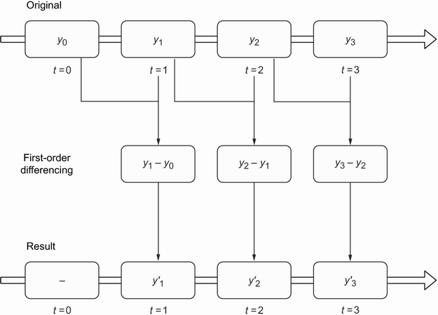<br>Visualizing a first-order difference</p>

#### Autoregressive (AR) Process

- Defining an autoregressive process: denoted as $AR(p)$, is the process where the present value $y_t$ is linearly dependent on its past values from $y_{t–1}$ to $y_{t–p}$.
- Identifying AR process & the order of AR model

  - In the case where the autocorrelation coefficients in ACF _slowly decay_ or exhibit a _sinusoidal_ pattern, then you are possibly in the presence of an **autoregressive** process.
  - This time we will have to plot the Partial Autocorrelation function (PACF) and see at which lag the coefficients suddenly become non-significant.

<p align="center">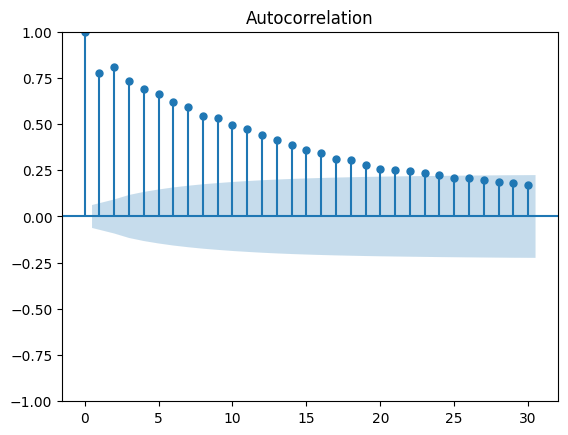<br>The plot is slowly decaying in ACF plot which is indicative of an autoregressive process.</p>

- Defining the partial autocorrelation function (PACF):
  - Suppose we have the following AR(2) process: $y_t = 0.33y_{t–1} + 0.50y_{t–2}$
  - In order to measure the correlation between $y_t$ and $y_{t-2}$,
    - Autocorrelation function (`ACF`) will capture both:
      - **Direct** impact of $y_{t-2}$ on $y_t$:
        - i.e: $y_{t-2}$ &#8594; $y_t$
      - **In-direct** impact of $y_{t-2}$ on $y_t$ via $y_{t-1}$:
        - i.e: $y_{t-2}$ &#8594; $y_{t-1}$ &#8594; $y_t$
        - This is because the $y_{t-2}$ also influencs on $y_{t-1}$ and $y_{t-1}$ then influences $y_t$
    - Partial Autocorrelation fuction (`PACF`) measures only the **direct** impact between each lag value, say $y_{t-2}$, and the $y_t$ and remove the influence of correlated lagged values, say $y_{t-1}$, in between (a.k.a. _confounding variables_)
- Using the PACF plot to determine the order $p$ of a stationary $AR(p)$ process: the **coefficients will be non-significant** after lag $p$.
  - The coefficients are non-significant after lag 3.

<p align="center">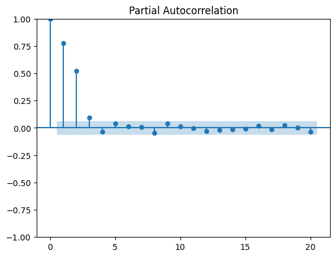<br>PACF plot on the stationary process of AR(3)</p>

- Forecasting a time series using the autoregressive model
  - _Note 1_: AR model assumes stationarity, so if the process is not stationary, the model has to be trained and testes on its stationary **differenced series**
  - _Note 2_: Once the champion model is identify on the stationary series, so we need to inverse-transform our predictions to bring them back to the original scale of the untransformed dataset by taking the cumulative sum of our predictions and add it to the last value of our training set in the original series.

#### Autoregressive Moving Average (ARMA) Process

- The autoregressive moving average model, denoted as $ARMA(p,q)$, is the combination of the autoregressive model $AR(p)$ and the moving average model $MA(q)$.
- An ARMA(p,q) process will display a **decaying pattern** or a **sinusoidal** pattern on _both the ACF and PACF_ plots.
  - Therefore, they cannot be used to estimate the orders $p$ and $q$.

| ACF plot exhibits a **decaying pattern** | PACF plot exhibits a **sinusoidal** pattern |
| :--------------------------------------: | :-----------------------------------------: |
|   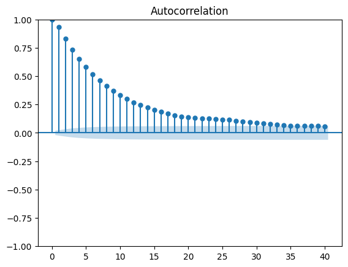    |    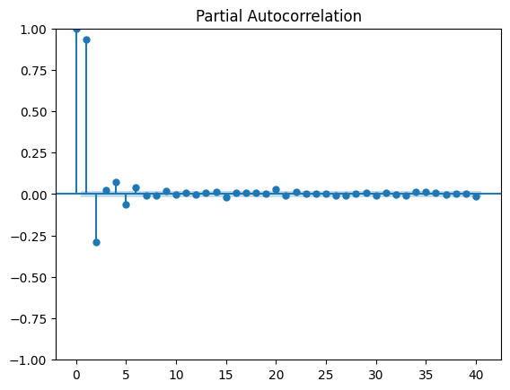     |

<p align="center">General modeling procedure for an ARMA(p, q) process<br>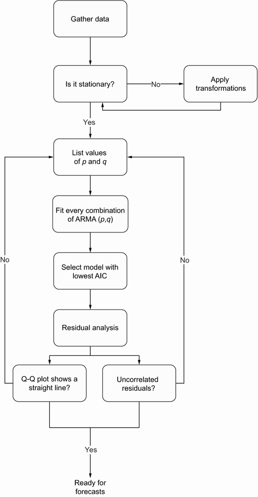</p>

- The **general modeling procedure** does not rely on the ACF and PACF plots. Instead, we fit many ARMA(p,q) models and perform model selection and residual analysis.
  - **Model selection** is done with the Akaike information criterion (AIC).
    - AIC quantifies the information loss of a model, and it is related to the number of parameters in a model and its goodness of fit. _The lower the AIC, the better the model_.
  - **Residual analysis** on the best model selected based on model selection - The **residuals** of a model are simply the difference between the predicted values and the actual values.
    - The qualitative analysis with **Q-Q plot** which is a graphical tool for comparing two distributions. We use it to compare the distribution of the _residuals_ against a theoretical _normal_ distribution.
      - If the plot shows a straight line that lies on y = x, then the residuals are **normally distributed**.
      - Otherwise, it means that the residuals are not normally distributed.
    - The quantitative analysis with **Ljung-Box** test which allows us to determine whether the residuals are _correlated_ or not.
      - The null hypothesis states that the data is independently distributed and uncorrelated.
        - If the returned p-values are larger than 0.05, we cannot reject the null hypothesis, meaning that the residuals are uncorrelated, just like white noise.
- Forecasting a time series using the ARMA(p,q) model identified from the previous **general modeling procedure**
  - _Note 1_: ARMA model assumes stationarity, so if the process is not stationary, the model has to be trained and testes on its stationary **differenced series**
  - _Note 2_: Once the champion model is identify on the stationary series, so we need to inverse-transform our predictions to bring them back to the original scale of the untransformed dataset by taking the cumulative sum of our predictions and add it to the last value of our training set in the original series.

#### Seasonal Autoregressive Integrated Moving Average (SARIMA) Process

- SARIMA(p,d,q)(P,D,Q)m model, which allows us to model **non-stationary** **seasonal** time series.
- The **seasonal** autoregressive integrated moving average (SARIMA) model, or $SARIMA(p,d,q)(P,D,Q)_m$ expands on $ARIMA(p,d,q)$ model by four new parameters in the model: $P$, $D$, $Q$, and $m$ to take into account **periodic** patterns when forecasting a time series
  - $m$ stands for the frequency which is the number of observations per cycle
    - If the data is every year (1 observation per year), then m=1
    - If data is collected every quarter (4 observations per year), then m = 4.
    - If the data is collected every month, then m = 12.
    - If the data is collected every week, then m = 52.
    - Note: If the data is collected on a **daily** or **sub-daily** basis, there are multiple ways of interpreting the frequency. (Please refer the "Appropriate frequency m for daily and sub-daily data" for more details)
      - It could be the frequency m = 7 as there would be seven observations in a full cycle of 1 week.
      - It could also have a yearly seasonality, meaning that m = 365.
  - $P$ is the order of the **seasonal AR(P)** process
  - $D$ is the **seasonal order** of integration: a seasonal difference makes the series stationary
  - $Q$ is the order of the **seasonal MA(Q)** process
- **Time series decomposition** can be used to identify seasonal patterns in a time series.
- **Forecasting with ARIMA**:
  - **Step 0**: deterime $m$ and perform _time series decomposition_ to identify seasonal patterns
  - **Step 1**: Check for stationarity and apply transformation in order to set the parameter $d$ & $D$ (seasonal difference)
  - **Step 2**: train-test split & prepare the baseline model
  - **Step 3**: Model selection with AIC to determine $p$, $q$, $P$ and $Q$
    - Note: The implementation of SARIMA in statsmodels simply uses $s$ instead of $m$ — they both denote the frequency.
  - **Step 4**: Forecasting
    - We apply the rolling forecast to get the prediction which means the model will be trained up to T before making the T+1 prediction.
  - **Step 5**: Model Evaluation
- Appendix of SARIMA:
<p align="center">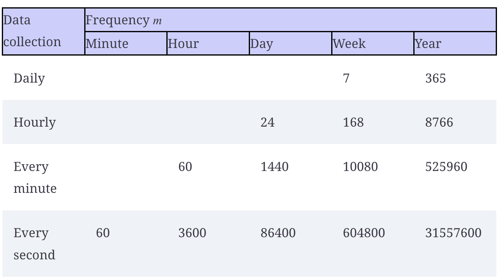<br>Appropriate frequency m for daily and sub-daily data</p>

#### SARIMA with Exogenous Variables (X)

- The SARIMAX model allows you to include external variables, also termed exogenous variables, to forecast your target.
- Transformations (differencing) are applied only on the target variable, not on the exogenous variables.
- Problem with Exogenous variables: SARIMAX is not recommended to forecast multiple timesteps into the future as the exogenous variables might not be available multiple steps in the future, so they must also be forecasted.
  - This can magnify the errors on the final forecast.
  - To avoid that, you must predict only the next timestep using the rolling forecast function.

## Day 2

### Baseline models (naive) for time series

- For time series, there are certain methods of heuristics or simple statistics to define the baseline model, namely:
  - Method 1 (Mean): to compute the mean of the values over **a certain period** or **entire period** and assume that future values will be equal to that mean.
    - For example, in the context of predicting the EPS for Johnson & Johnson, the average EPS between 1960 and 1979 was $4.31. Therefore the EPS over the next four quarters of 1980 to be equal to $4.31 per quarter.
  - Method 2 (Last known value): to naively forecast the last recorded data point.
    - For example, if the EPS is $0.71 for this quarter, then the EPS will also be $0.71 for next quarter.
  - Method 3 (Last season): to repeat that pattern into the future if there is a cyclical pattern in the data
    - For example, if the EPS is $14.04 for the first quarter of 1979, then the EPS for the first quarter of 1980 will also be $14.04.
  - Method 4 (Drift method): a modification of predicting the last known value.
    - In this case, we allow the values to increase or decrease over time.
    - The rate at which values will change in the future is equal to that seen in the train set.
    - Therefore, it is equivalent to calculating the slope between the first and last value of the train set and simply extrapolating this straight line into the future.
      - $y_f$ the last value in the training set
      - $y_i$ the initial value in the training set
        $$\text{slope (drift)}= \frac{\Delta y}{\Delta x} = \frac {y_f - y_i}{\text{number of timesteps} - 1}$$
        $$forecast = slope * timestep + y_i$$

#### How to define the baseline model for a time-series

- We can experiment 5 different baselines:
  - The mean of the entire training set (`hist_mean`)
  - The mean of the last year in the training set (`last_year_mean`)
  - The last known value of the train set (`last`)
  - The naive seasonal forecast (`naive_seasonal`)
  - The drift forecast
- Each baseline was then evaluated on a test set using the MAPE metric
- For the predicting EPS for Johnson & Johnson model,
  - Train-test split:
    - The train set will consist of the data from 1960 to the end of 1979
    - The test set will consist of the four quarters of 1980.
    - The model is to preidct the EPS in four quarters of 1980
  - MAPE on the test set if we use the mean of the entire training set (`hist_mean`) is 70.00%. This means that our baseline deviates by 70% on average from the actual values.
  - MAPE on the test set if we use the mean of the last year in the training set (`last_year_mean`) is reduced to 15.6%. This means that our forecasts deviate from the observed values by 15.6% on average.
    - We can learn from this baseline that future values likely depend on past values that are _not too far back in history_.
      - This is a sign of **autocorrelation**.
  - MAPE on the test set if we use the last known value of the train set (`last`) is 30.45%.
    - This can be explained by the fact that the EPS displays a **cyclical behavior**, where it is high during the first three quarters and then falls at the last quarter.
    - Using the last known value **does not take the seasonality into account**, so we need to use another naive forecasting technique to see if we can produce a better baseline.
  - MAPE on the test set if we use the naive seasonal forecast (`naive_seasonal`) is 11.56%, which is the lowest MAPE from all the baselines.
    - This means that **seasonality has a significant impact on future values**, since repeating the last season into the future yields fairly accurate forecasts
    - Seasonal effects will have to be considered when we develop a more complex forecasting model for this problem.

<p align="center"><br>The MAPE of the four baselines</p>

### Tips

- Forecasting feature selection problem: at time making predictions, we cannot use the features that are not available.
  - For example, if we cannot use the temperature as a feature to predict power consumption over the next day as we dont have the value of temperature in the next day
- List of Time-series models: https://unit8co.github.io/darts/
- When creating time-series features (especially rolling or lag), remember to DROP `NaN`

### Backtesting

- Backtesting methods with the use of Scikit-learn's `TimeSeriesSplit`

## Day 1

### Differentiation

- ARIMA assumes the stationarity of the data. If non-stationarity is found, the series should be differenced until stationarity is achieved. This analysis helps to determine the optimal value of the parameter $𝑑$.
- `df.diff()` calculates the difference of a DataFrame element compared with another element in the DataFrame (default is element in previous row).
  - Note: usually go along with dropna `df.diff().dropna()`

### Feature Engineering

#### Date Features

- Time series features to see how the trends are impacted by day of week, hour, time of year + holiday factor.
  - Note: for Weekday factor we can assign different weight for different day in a week

```Python
df['date'] = df.index
df['hour'] = df['date'].dt.hour
df['dayofweek'] = df['date'].dt.dayofweek
df['quarter'] = df['date'].dt.quarter
df['month'] = df['date'].dt.month
df['year'] = df['date'].dt.year
df['dayofyear'] = df['date'].dt.dayofyear
df['dayofmonth'] = df['date'].dt.day
df['weekofyear'] = df['date'].dt.weekofyear
```

- Also can include `is_holiday` col

```Python
import holidays
us_holidays = holidays.US()
df['ds'] = df.index
df['isholiday'] = df['ds'].apply(lambda x : x in us_holidays).astype(np.int32)
df.drop(columns = ['ds'], inplace=True)
```

#### Technical Indicator Features

- **Lag** features are added to convert time series forecasting as a supervised Machine Learning problem
  - Lag with respect to a time step $t$ is defined as the values of the series at previous $t$ time steps.
  - For example, lag 1 is the value at time step $t-1$ and lag $m$ is the value at time step $t-m$
- **Rolling (mean, std, min, max)**
- **Rate of Change**

### FB Prophet Model

- Prophet model expects the dataset to be named a specific way.
  - Including the holidays

```Python
from fbprophet import Prophet

# Setup and train model and fit by convert
# .reset_index() to convert datetime index to 'Datetime' col
# 'Datetime' col to 'ds'
# 'Target' col to 'y'
model = Prophet()
model.fit(df.reset_index() \
              .rename(columns={'Datetime':'ds',
                               'Target':'y'}))
"""
including holidays
"""

# Create a dataframe with holiday, ds columns
from pandas.tseries.holiday import USFederalHolidayCalendar as calendar

cal = calendar()

df['date'] = df.index.date
df['is_holiday'] = df.date.isin([d.date() for d in cal.holidays()])
holiday_df = df.loc[df['is_holiday']] \
    .reset_index() \
    .rename(columns={'Datetime':'ds'})
# create 'holiday' col in holiday_df and provide what is the holiday name
holiday_df['holiday'] = 'USFederalHoliday'
holiday_df = holiday_df.drop(['is_holiday'], axis=1)
# final holiday_df will have 2 cols only: 'ds' and 'holiday'
holiday_df['ds'] = pd.to_datetime(holiday_df['ds'])

# Init and train model with holidays
model_with_holidays = Prophet(holidays=holiday_df)
```

### Tips

- When dealing with time-series data, it is better to use dates as the index of the dataframe
