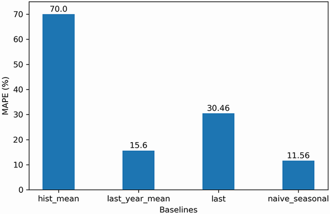

# Baseline Model

# Baseline Model

## Introduction

### What is Baseline model ?

- A baseline model is a trivial solution to our problem. It often uses heuristics, or simple statistics, to generate predictions.

### Baseline model for time series

- For time series, there are certain methods of heuristics or simple statistics to define the baseline model, namely:
  - Method 1 (Mean): to compute the mean of the values over **a certain period** or **entire period** and assume that future values will be equal to that mean.
    - For example, in the context of predicting the EPS for Johnson & Johnson, the average EPS between 1960 and 1979 was $4.31. Therefore the EPS over the next four quarters of 1980 to be equal to $4.31 per quarter.
  - Method 2 (Last known value): to naively forecast the last recorded data point.
    - For example, if the EPS is $0.71 for this quarter, then the EPS will also be $0.71 for next quarter.
  - Method 3 (Last season): to repeat that pattern into the future if there is a cyclical pattern in the data
    - For example, if the EPS is $14.04 for the first quarter of 1979, then the EPS for the first quarter of 1980 will also be $14.04.

## How to define the baseline model for a time-series

- We can experiment four different baselines:
  - The mean of the entire training set (`hist_mean`)
  - The mean of the last year in the training set (`last_year_mean`)
  - The last known value of the train set (`last`)
  - The naive seasonal forecast (`naive_seasonal`)
- Each baseline was then evaluated on a test set using the MAPE metric
- For the predicting EPS for Johnson & Johnson model,
  - Train-test split:
    - The train set will consist of the data from 1960 to the end of 1979
    - The test set will consist of the four quarters of 1980.
    - The model is to preidct the EPS in four quarters of 1980
  - MAPE on the test set if we use the mean of the entire training set (`hist_mean`) is 70.00%. This means that our baseline deviates by 70% on average from the actual values.
  - MAPE on the test set if we use the mean of the last year in the training set (`last_year_mean`) is reduced to 15.6%. This means that our forecasts deviate from the observed values by 15.6% on average.
    - We can learn from this baseline that future values likely depend on past values that are _not too far back in history_.
      - This is a sign of **autocorrelation**.
  - MAPE on the test set if we use the last known value of the train set (`last`) is 30.45%.
    - This can be explained by the fact that the EPS displays a **cyclical behavior**, where it is high during the first three quarters and then falls at the last quarter.
    - Using the last known value **does not take the seasonality into account**, so we need to use another naive forecasting technique to see if we can produce a better baseline.
  - MAPE on the test set if we use the naive seasonal forecast (`naive_seasonal`) is 11.56%, which is the lowest MAPE from all the baselines.
    - This means that **seasonality has a significant impact on future values**, since repeating the last season into the future yields fairly accurate forecasts
    - Seasonal effects will have to be considered when we develop a more complex forecasting model for this problem.

 The MAPE of the four baselines

