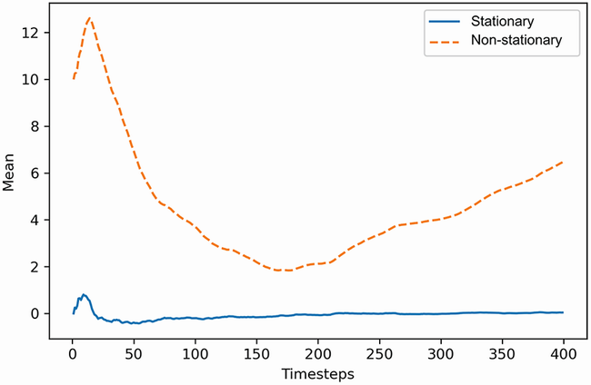
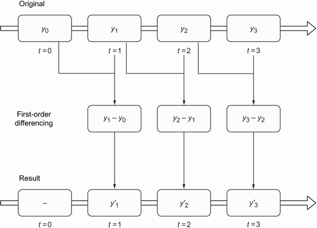

# Stationary

## What is Stationary

- A stationary time series is one whose statistical properties do not change over time
  - Namely: constant mean, variance, and autocorrelation, and these properties are independent of time.
- Intuitively, this makes sense, because if the data is non-stationary, its properties are going to change over time, which would mean that our model parameters must also change through time.
<p align="center"><br>Figure: Mean of stationary and non-stationary series over time. You can see how the mean of the stationary process becomes constant after the first few timesteps. On the other hand, the mean of the non-stationary process is a clear function of time, as it is constantly changing.</p>

```Python
def stat_over_time(ts: np.array, metrics: str="mean"):
    # This function is to compute the statistics (mean, variance) over the time of a series
    acc_stats = []

    for i in range(len(ts)):
        if metrics == "mean":
          acc_stats.append(np.mean(ts[:i]))
        if metrics == "variance":
          acc_stats.append(np.var(ts[:i]))
    return acc_stats

non_stationary_mean = mean_over_time(random_walk)
stationary_mean = mean_over_time(diff_random_walk)
```

## Testing for Stationary

- The function `check_stationarity` combines both ADF and KPSS tests for checking the stationary in the time series.

```Python
from statsmodels.tsa.stattools import adfuller, kpss

def check_stationarity(series, p_significant=0.05):
    # Copied from https://machinelearningmastery.com/time-series-data-stationary-python/

    adfuller_result = adfuller(series.values)
    kpss_result = kpss(series.values)

    print(f'ADF Statistic : {adfuller_result[0]:.5f}, p-value: {adfuller_result[1]:.5f}')
    print('Critical Values:')
    for key, value in adfuller_result[4].items():
        print('\t%s: %.3f' % (key, value))
    print(f'KPSS Statistic: {kpss_result[0]:.5f}, p-value: {kpss_result[1]:.5f}')
    if (adfuller_result[1] <= p_significant) & (adfuller_result[4]['5%'] > adfuller_result[0]) & (kpss_result[1] > p_significant):
        print("\u001b[32mStationary\u001b[0m")
    else:
        print("\x1b[31mNon-stationary\x1b[0m")
```

### Augmented Dickey-Fuller (ADF) Test

- **Augmented Dickey-Fuller** test takes as its null hypothesis that the time series has a **unit root** - a characteristic of non-stationary time series. Conversely, the alternative hypothesis (under which the null hypothesis is rejected) is that the series is stationary.
  - Null Hypothesis ($H_0$): The series is not stationary or has a unit root.
  - Alternative hypothesis ($H_A$): The series is stationary with no unit root.
- **Rule**: the p-value obtained should be less than a specified significance level, often set at 0.05, to reject this hypothesis.

```Python
from statsmodels.tsa.stattools import adfuller

print(f'ADF Statistic: {adfuller_result[0]}, p-value: {adfuller_result[1]}')
```

### Kwiatkowski-Phillips-Schmidt-Shin (KPSS) Test

- The KPSS test checks if a time series is stationary around a mean or linear trend.
- **Rule**: small p-values (e.g., less than 0.05) rejects the null hypothesis and suggest that differencing is required.

```Python
from statsmodels.tsa.stattools import adfuller
from statsmodels.tsa.stattools import kpss

print(f'KPSS Statistic: {kpss_result[0]}, p-value: {kpss_result[1]}')
```

## Transformations to achieve the Stationary Series

- If it is not stationary, we apply transformations (differencing or log) until stationarity is achieved.

### Differencing

- Differencing involves calculating the series of changes from one timestep to another.
  - i.e: subtract the value of the previous timestep $y_{t–1}$ from the value in the present yt to obtain the differenced value $y'_t$.
- This transformation is useful for stabilizing the mean.
- Taking the difference once is applying a _first-order differencing_. Taking it a second time would be a _second-order differencing_.
<p align="center"><br>Figure: first-order differencing is applied. Notice how we lose one data point (t=0) after this transformation because the initial point in time cannot be differenced with previous values since they do not exist.</p>

### Log Tranformation

- Logarithms are used to help stabilize the variance.
