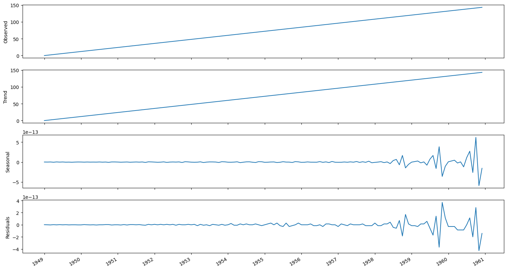

# Time Series Decomposition

## Introduction

- **Time series decomposition** can be used to identify seasonal patterns in a time series.
- Time series decomposition is a statistical task that separates the time series into its three main components:
  - **Trend** component: long-term change (increase & decrease) in the time series
  - **Seasonal** component: repeated fluctuations that occur over a fixed period of time.
  - **Residuals**: the noise, express any irregularity that cannot be explained by the trend or the seasonal component.

## Identifying Seasonal Period

- Step 1 - `pd.infer_freq `function: infer the frequency of a datetime index in a DataFrame or Series.
  - This can be useful if you want to understand the **general frequency of your time series data**, such as daily, monthly, or yearly.

```Python
freq = pd.infer_freq(train_df[datetime_col])
print(f"Inferred frequency: {freq}")
```

- Step 2 - `periodogram` from statsmodel: etermine the seasonality period by analyzing the periodogram.
  - Create the periodogram: This involves calculating the Fourier transform of the time series.
  - Analyze the periodogram: Identify the significant peaks which correspond to the dominant seasonal cycles.

```Python
from statsmodels.tsa.stattools import periodogram

# Calculate the periodogram
frequencies, spectrum = periodogram(train_df)
# Identify the dominant frequency
dominant_frequency = frequencies[np.argmax(spectrum)]
seasonal_period = 1 / dominant_frequency
print(f"Dominant frequency: {dominant_frequency}")
print(f"Seasonal period: {seasonal_period} days")
```

## Decomposing The Series

### `seasonal_decompose`

- `seasonal_decompose` is a classical decomposition method.
- Assumption: the seasonal component is either **additive** or **multiplicative** and requires the seasonal period to be known.
- Advantages:
  - **Additive or Multiplicative**: It supports both additive and multiplicative decomposition models.
  - **Requires Period**: You need to specify the seasonal period (number of observations per cycle).
  - **Simple and Fast**: Suitable for quick analysis and when you have a clear understanding of the seasonal period.

### `STL` (Seasonal and Trend Decomposition using Loess)

- Advantages:
  - **Flexibility**: Can handle complex seasonal patterns and is robust to outliers.
  - **Iterative Method**: Uses LOESS for smoothing, which can be computationally intensive but provides a more detailed decomposition.
  - **No Period Requirement**: The seasonal period must still be specified, but STL can handle more irregular seasonal patterns.
- Using the `STL` function of `statsmodels` to decompose the time series.
  - The `period` is equal to the frequency $m$.
    - Since in the below Example 1, we have monthly data, the **period is 12**.

```Python
from statsmodels.tsa.seasonal import STL
# Decompose the series using the STL function.
def decompose_ts(df, period):
    decomposition = STL(df, period=period).fit()

    fig, (ax1, ax2, ax3, ax4) = plt.subplots(nrows=4, ncols=1, sharex=True, figsize=(15,8))

    ax1.plot(decomposition.observed)
    ax1.set_ylabel('Observed')

    ax2.plot(decomposition.trend)
    ax2.set_ylabel('Trend')

    ax3.plot(decomposition.seasonal)
    ax3.set_ylabel('Seasonal')

    ax4.plot(decomposition.resid)
    ax4.set_ylabel('Residuals')

    fig.autofmt_xdate()
    plt.tight_layout()
```

- **Example 1**: a time-series with seasonal pattern

```Python
# load & review the data
df = pd.read_csv("../../data/book-time-series-forecasting-in-python/air-passengers.csv")
df.head()
```

<p align="center"></p>

- From the plot, there is a repeating pattern every year, with
  - A high number of passengers being recorded during June, July, and August of each year
  - Fewer passengers in November, December, and January of each year.

```Python
# The period is equal to the frequency m. Since we have monthly data, the period is 12.
decompose_ts(df['Passengers'], period=12)
```

<p align="center"><br>The decompose plots of the time series</p>

- The first plot shows the observed data.
- The second plot shows the trend component, which tells us that the number of air passengers is increasing over time.
- The third plot displays the seasonal component, and we can clearly see a repeating pattern through time.
- The last plot shows the residuals, which are variations in the data that cannot be explained by the trend or the seasonal component.
- **Example 2**: a time series with no seasonal pattern

```Python
# example of non-seasonal time-series
decompose_ts(np.arange(0, 144, 1), period=4)
```

<p align="center"><br>The decompose plots of the time series with no seasonals</p>
