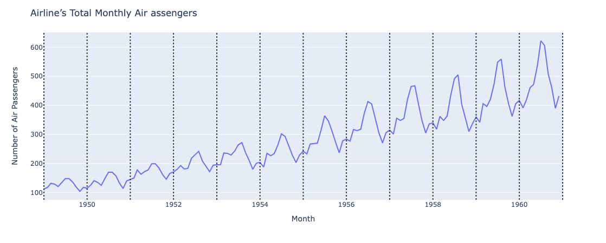
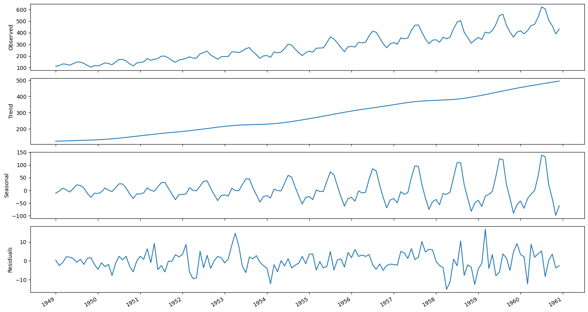

# Time Series Decomposition

- **Time series decomposition** can be used to identify seasonal patterns in a time series.
- Time series decomposition is a statistical task that separates the time series into its three main components:
  - **Trend** component: long-term change (increase & decrease) in the time series
  - **Seasonal** component: repeated fluctuations that occur over a fixed period of time.
  - **Residuals**: the noise, express any irregularity that cannot be explained by the trend or the seasonal component.
- Using the `STL` function of `statsmodels` to decompose the time series.
  - The `period` is equal to the frequency $m$.
    - Since in the below Example 1, we have monthly data, the period is 12.

```Python
from statsmodels.tsa.seasonal import STL
# Decompose the series using the STL function.
def decompose_ts(df, period):
    decomposition = STL(df, period=period).fit()

    fig, (ax1, ax2, ax3, ax4) = plt.subplots(nrows=4, ncols=1, sharex=True, figsize=(15,8))

    ax1.plot(decomposition.observed)
    ax1.set_ylabel('Observed')

    ax2.plot(decomposition.trend)
    ax2.set_ylabel('Trend')

    ax3.plot(decomposition.seasonal)
    ax3.set_ylabel('Seasonal')

    ax4.plot(decomposition.resid)
    ax4.set_ylabel('Residuals')

    plt.xticks(np.arange(0, 145, 12), np.arange(1949, 1962, 1))

    fig.autofmt_xdate()
    plt.tight_layout()
```

- **Example 1**: a time-series with seasonal pattern

```Python
# load & review the data
df = pd.read_csv("../../data/book-time-series-forecasting-in-python/air-passengers.csv")
df.head()
```

<p align="center"></p>

```Python
# The period is equal to the frequency m. Since we have monthly data, the period is 12.
decompose_ts(df['Passengers'], period=12)
```

<p align="center"><br>The decompose plots of the time series</p>

- The first plot shows the observed data.
- The second plot shows the trend component, which tells us that the number of air passengers is increasing over time.
- The third plot displays the seasonal component, and we can clearly see a repeating pattern through time.
- The last plot shows the residuals, which are variations in the data that cannot be explained by the trend or the seasonal component.
- **Example 2**: a time series with no seasonal pattern

```Python
# example of non-seasonal time-series
decompose_ts(np.arange(0, 144, 1), period=4)
```
