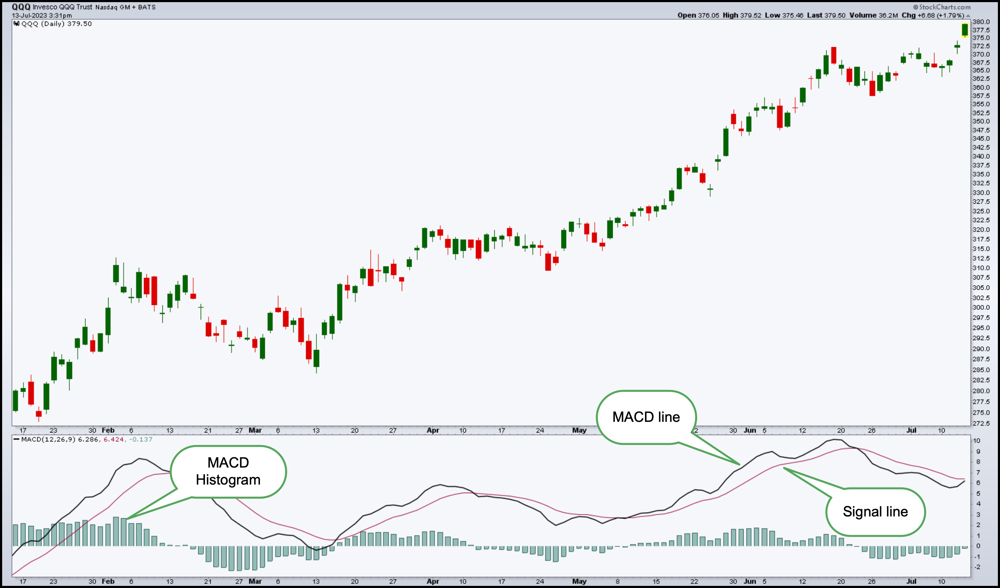

# Technical Indicators

## Simple Moving Average (SMA)

- SMA indicator that smooths out short-term price fluctuations, making it easier to identify overall trend direction.
  - When the price crosses _above the SMA_, it may indicate a **bullish** trend.
  - When the price crosses _below the SMA_, it may indicate a **bearish** trend.
- SMA is equivalent to the rolling mean.

```Python
def calculate_sma(data, window=10):
    sma = data.rolling(window=window).mean()  # Calculate SMA using rolling window
    return sma

window_size = 10  # Specify the window size for SMA
df['SMA'] = calculate_sma(df['Price'], window=window_size)
```

## Exponential Moving Average (EMA)

- EMA calculates the weighted average of price data, which smooths out price fluctuations and gives more weightage to recent data points.
  - This helps EMA more quickly to recent price changes, making it useful for **short-term** trend analysis.
  - When the price crosses above the EMA, it may indicate a bullish trend.
  - When the price crosses below the EMA, it may indicate a bearish trend.

$$\text{EMA}_t = (1 - \alpha)\text{EMA}_{t-1} + \alpha X_t$$

- Where:
  - $\text{EMA}_t$ is the Exponential Moving Average at time t
  - $\text{EMA}_{t-1}$ is the Exponential Moving Average at time (t-1)
  - $X_t$ is the observation (price, value, etc.) at time t
  - $\alpha$ is the smoothing factor or weight applied to the most recent observation
    - Formula: $\alpha = \frac{2}{span+1}$
    - A smaller $span$ value results in a larger $\alpha$ (more weight to recent data)
    - A larger $span$ value leads to a smaller $\alpha$ (smoothing out fluctuations over more time periods).

```Python
def calculate_ema(data, window=10):
    ema = data.ewm(span=window, adjust=False).mean()  # Calculate EMA using exponential weighted average
    return ema

window_size = 10  # Specify the window size for EMA
df['EMA'] = calculate_ema(df['Price'], window=window_size)
```

## Moving Average Convergence Divergence (MACD)

- Moving Average Convergence Divergence (MACD) is momentum indicator used by traders and analysts to identify shifts in market momentum and potential breakout points.
- MACD is based on the relationship between two Exponential Moving Averages (EMAs) and includes a Signal Line (Trigger Line) to generate buy or sell signals.
- Steps to calculate MACD:
  - Step 1: calculate Fast & Slow EMAs
    - Short-term EMA (Fast EMA): typically based on a 12-period EMA
    - Long-term EMA (Slow EMA): Typically based on a 26-period EMA.
  - Step 2: calculate MACD Line
    - $\text{MACD Line} = \text{Fast EMA} - \text{Slow EMA}$
  - Step 3: calculate Signal Line (Trigger Line)
    - $\text{Signal Line} = \text{EMA of MACD Line}$ typically a 9-period EMA of the MACD Line
  - Step 4: calculate MACD Histogram
    - $\text{MACD Histogram} = \text{MACD Line - Signal Line}$

<p align="center"></p>

- Interpretation of MACD:
  - **MACD Line and Signal Line Crosses**:
    - Bullish Signal: When the MACD Line crosses above the Signal Line (MACD Line > Signal Line).
      Bearish Signal: When the MACD Line crosses below the Signal Line (MACD Line < Signal Line).
  - **MACD Histogram**:
    - Positive Histogram: Indicates increasing bullish momentum.
    - Negative Histogram: Indicates increasing bearish momentum.
    - Divergence between MACD Histogram and price movements can signal potential trend reversals.

## Relative Strength Index (RSI)

- Relative Strength Index (RSI) measures the speed and change of price movements.
- The RSI is typically used to identify **overbought** or **oversold** conditions in an asset's price.
- Steps to calculate RSI:
  - Step 1: calculate Price Changes
    - Compute the `price changes` over a specified period (usually period=14) bycomparing each day's closing price to the previous day's closing price.
    - Calculate the `average gain` (average of positive `price changes`) over the period
    - Calculate the `average loss` (average of negative `price changes`) over the period
  - Step 2: calculate Relatiev Strength (RS):
    - $\text{Relative Strength (RS)} = \text{Average Gain} / \text{Average Loss}$
  - Step 3: calculate RSI
    - $\text{RSI} = 100 - \frac{100}{1+\text{RS}}$
- Interpretation of RSI:
  - **RSI Range**: The RSI value ranges from 0 to 100
  - **Overbought Conditions (High RSI)**: An RSI _above 70_ is often considered overbought, suggesting that the asset may be due for a price correction or reversal.
  - **Oversold Conditions (Low RSI)**: An RSI _below 30_ is often considered oversold, indicating that the asset may be undervalued and could potentially see a price rebound or rally.
  - **Divergence**: Divergence between price movements and RSI can signal potential trend reversals or continuations.
  - **RSI Period**: The standard period for RSI calculation is 14 periods, but this can be adjusted based on the analysis timeframe and preferences.

```Python
def calculate_rsi(data, window=14):
    # Calculate price changes
    delta = data.diff()

    # Separate gains and losses
    gain = (delta.where(delta > 0, 0)).rolling(window=window).mean()
    loss = (-delta.where(delta < 0, 0)).rolling(window=window).mean()

    # Calculate Relative Strength (RS)
    rs = gain / loss

    # Calculate RSI
    rsi = 100 - (100 / (1 + rs))
    return rsi

# Assuming df is your DataFrame with 'Date' and 'Close' columns
df['RSI'] = calculate_rsi(df['Close'])

# Plot RSI
plt.figure(figsize=(10, 6))
plt.plot(df['Date'], df['RSI'], label='RSI')
plt.axhline(70, color='r', linestyle='--', label='Overbought (70)')
plt.axhline(30, color='g', linestyle='--', label='Oversold (30)')
plt.xlabel('Date')
plt.ylabel('RSI')
plt.title('Relative Strength Index (RSI)')
plt.legend()
plt.grid(True)
plt.show()
```

## Bollinger Bands

- Bollinger Bands (BOL) are a popular technical analysis tool used to measure the volatility of a market and identify potential overbought or oversold conditions.
- They consist of three lines:
  - **Simple Moving Average** (SMA) in the middle
  - **Upper Band**: $\text{SMA} + (\text{Standard Deviation} * K)$
  - **Lower Band**: $\text{SMA} - (\text{Standard Deviation} * K)$
    - $K$ is a constant (typically 2) that represents the number of standard deviations.
- Interpretation of Bollinger Bands
  - **Price within Bands**: When the price remains within the bands, it suggests a **period of consolidation** or range-bound trading.
  - **Price above Upper Band**: Indicates potential **overbought** conditions, suggesting a possible reversal or correction.
  - **Price below Lower Band**: Indicates potential **oversold** conditions, suggesting a possible bounce or rally.
  - **Narrow Bands (Low Volatility)**: When the bands are close together, it indicates low volatility and suggests that **a period of high volatility may be forthcoming**.
  - **Wide Bands (High Volatility)**: Conversely, when the bands widen, it indicates high volatility in the market.

```Python
# Calculate Simple Moving Average (SMA) and Standard Deviation
window_size = 20  # Window size for SMA and Standard Deviation
sma = df['Close'].rolling(window=window_size).mean()
std_dev = df['Close'].rolling(window=window_size).std()

# Calculate Upper and Lower Bands
k = 2  # Constant for number of standard deviations
upper_band = sma + (std_dev * k)
lower_band = sma - (std_dev * k)
```
