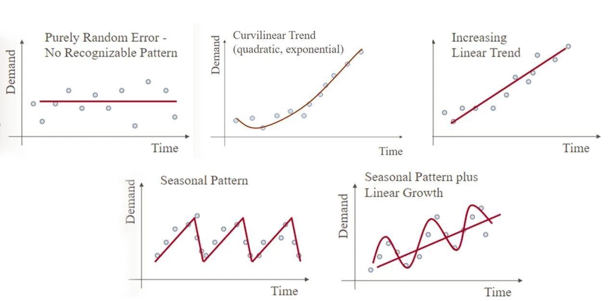

# Introduction

## Time Series Definition

- A time series is a sequence of data points, typically measured at successive times, spaced at uniform time intervals.
- Types of time-series:
  - **Univariate** one value against time, for example temperatures over time in London, United Kingdom.
  - **Multivariate** multiple values against time
- A typical time series model can exhibits different patterns.
  - Economic data is often seasonal, meaning that there is a regular pattern of ups and downs over the course of a year.
  - Weather data is often chaotic, meaning that it is very difficult to predict even short-term future values.
  - Social media data is often volatile, meaning that it can change rapidly and unexpectedly.

- A time series can be a graph of a combination of all of above patterns . Therefor it is important to understand _components of a time series_ in detail

## Components of a time series

- A time series it is composed of **Trend (T)** , **Seasonality (S)**, **Cyclic (C)** and **Residual (R)** components.

$$ U_t = T_t + S_t + C_t + R_t $$

1. _Trend Component_: The long-term tendency of a series to increase or fall (upward trend or downward trend).

2. _Seasonality Component_: The periodic fluctuation in the time series within a certain period. These fluctuations form a pattern that tends to repeat from one seasonal period to the next one.

3. _Cycles Component_: Long departures from the trend due to factors others than seasonality. Cycles usually occur along a large time interval, and the lengths of time between successive peaks or troughs of a cycle are not necessarily the same.

4. _Irregular movement Component_: The movement left after explaining the trend, seasonal and cyclical movements; random noise or error in a time series.

## Technical Problems associated with time series

- The three main machine learning problems with time series are
  - **Forecasting**: The use of a model to predict future values based on previously observed values.
    - Model: ARIMA or exponential smoothing.
  - **Decomposition**: This technique is used to separate the data into its constituent parts such as trend, seasonality, and residuals.
    - Techinque: additive or multiplicative decomposition.
  - **Classification & Regression**: This technique is used to predict a target variable based on the time series data.
    - Model: Support vector machines or logistic regression.
  - **Anomaly detection**: Identifying unusual patterns (outliers) in a time series. Outliers are unusual observations that fall outside of the typical pattern.
  - **Clustering**: This technique is used to group together similar time series. This can be done using methods such as k-means clustering.
  - **Drift detection**: This technique is used to identify systematic changes in the time series data.
    - Technique: Mann-Kendall test
  - **Smoothing**: This technique is used to remove the noise from the data.
    - Technique: exponential smoothing.

## Time series Machine Learning Framework

1. **Define the problem**: Is it a classification or regression problem? What are the inputs and outputs? What are the steps involved in solving the problem?
2. **Data Exploration**: This step involves visualizing the data to understand the trends and patterns. This helps in developing the intuition for building the machine learning model.
3. **Preprocess the data**: This step involves cleaning the data, dealing with missing values, and transforming the data so that it can be used by the machine learning algorithm. This step is crucial and includes feature engineering, scaling, normalization.
4. **Decompose the time series**: This step is useful in understanding the trend, seasonality, and noise in the data. This step is necessary for certain kinds of methods, but not with others.
5. **Build models**: Once the data is preprocessed, you can build models using traditional machine learning algorithms or time series specific algorithms.
6. **Evaluate the models**: This step includes comparing the performance of different models and choosing the best one. It involves assessing the performance of the machine learning model on unseen data. This helps in fine-tuning the model and making it ready for deployment.
7. **Make predictions**: This step involves using the final model to make predictions on new data.
