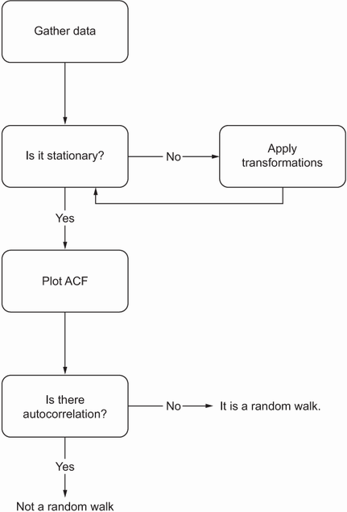
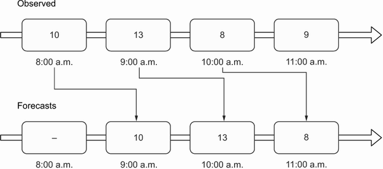

# Random Walk

TLDR:

- There are instances where the simplest (naive forecasting) methods will yield the best forecasts in compared with sophisticated methods such as statistical or deep learning models. This is the case when we face a **random walk** process.
- A random walk is a sequence where the **first difference** is **not autocorrelated** (i.e.: ACF will show no significant coefficients after lag 0) and is a **stationary** process, meaning that its mean, variance, and autocorrelation are constant over time.
  - Because a random process takes random steps into the future, we **cannot use statistical or deep learning** techniques to fit such a process: there is **nothing to learn from randomness** and it cannot be predicted. Instead, we must **rely on naive forecasting methods**.
- If the process is not a random walk, so it can be approximated by the moving average (MA) model, an autoregressive (AR) model, or the combination of both processes, leading to an autoregressive moving average (ARMA) model.

## What is Random Walk Process

- A random walk is a process in which there is an equal chance of going up or down by a random number.
- Mathematically express a random walk with the following equation:
  - $y_t$ the value at the present time t
  - $C$ is a constant
  - $y_{t-1}$ is the value at the previous timestep t–1
  - $\epsilon_t$ is a random number (**white-noise**), which is the realization of the standard normal distribution, which has a variance of 1 and a mean of 0

$$y_t = C + y_{t-1} + \epsilon_t$$

### Simulating a random walk process

By initializing our random walk process at 0 (i.e: $y_{t=0}=0$) and setting the constant $C$ to 0, we determine that the value at time $t$ is simply the sum of white noise from $t=1$ to time $t$, i.e. $y_t = \sum_{t=1}^T{\epsilon_t}$

```Python
import numpy as np
import plotly.express as px
np.random.seed(42)

steps = np.random.standard_normal(1000)
steps[0]=0 # set y_0 = 0
# define the random walk
random_walk = np.cumsum(steps)

def plot_timeseries(ts:np.ndarray,
                    title:str,
                    x = None,
                    ylabel: str = "value",
                    xlabel: str = "timesteps"):
    fig = px.line(x=range(0, len(ts)) if x is None else x, y=ts)
    fig.update_layout(
        title=title,
        yaxis_title=ylabel,
        xaxis_title=xlabel
    )
    fig.show()

plot_timeseries(random_walk, "Random Walk Simulation")
```

## Identifying a Random Walk

- A random walk is the series which is **stationary** (ADF test) and **un-correlated** (ACF plot) after a first-order differencing
- Step 1: test for stationarity (ADF, KPSS test).
  - If it is not stationary, we apply transformations (differencing or log) until stationarity is achieved.
- Step 2: Then we can plot the autocorrelation function (ACF).
  - If there is no autocorrelation, we have a random walk.

<p align="center"></p>

### Stationary

- A stationary time series is one whose statistical properties do not change over time
  - Namely: constant mean, variance, and autocorrelation, and these properties are independent of time.
- Intuitively, this makes sense, because if the data is non-stationary, its properties are going to change over time, which would mean that our model parameters must also change through time.

```Python
from statsmodels.tsa.stattools import adfuller, kpss

def check_stationarity(series, p_significant=0.05):
    # Copied from https://machinelearningmastery.com/time-series-data-stationary-python/

    adfuller_result = adfuller(series)
    kpss_result = kpss(series)

    print(f'ADF Statistic : {adfuller_result[0]:.5f}, p-value: {adfuller_result[1]:.5f}')
    print('Critical Values:')
    for key, value in adfuller_result[4].items():
        print('\t%s: %.3f' % (key, value))
    print(f'KPSS Statistic: {kpss_result[0]:.5f}, p-value: {kpss_result[1]:.5f}')
    if (adfuller_result[1] <= p_significant) & (adfuller_result[4]['5%'] > adfuller_result[0]) & (kpss_result[1] > p_significant):
        print("\u001b[32mStationary\u001b[0m")
    else:
        print("\x1b[31mNon-stationary\x1b[0m")
```

### Autocorrelation Function

- Once a process is stationary, plotting the autocorrelation function (ACF) is a great way to understand what type of process you are analyzing.
  - In this case, we will use it to determine if we are studying a random walk or not.
- The autocorrelation function (ACF) measures the linear relationship between lagged values of a time series.
  - In other words, it measures the correlation of the time series with itself.
  - The autocorrelation coefficient between $y_t$ and its lag=0 or $y_{t-0}=y_t$ is always $1$
  - The autocorrelation coefficient between $y_t$ and its lag=1 or $y_{t-1}$ is $r_1$
  - The autocorrelation coefficient between $y_t$ and its lag=2 or $y_{t-2}$ is $r_2$
- Understanding the ACF plot:
  - In the presence of a trend, a plot of the ACF will show that the coefficients are high for short lags, and they will decrease linearly as the lag increases.
  - In the presence of a seasonal, the ACF plot will also display cyclical patterns.

```Python
# Because our random walk is not stationary, we need to apply a transformation to make it stationary in order to retrieve useful information from the ACF plot.
diff_random_walk = np.diff(random_walk, n=1)

from statsmodels.graphics.tsaplots import plot_acf

plot_acf(diff_random_walk, lags=20);
```

<p align="center"><br>There are no significant coefficients after lag 0 in the ACF plot</p>

- The shaded area represents a confidence interval.
  - If a point is within the shaded area, then it is not significantly
  - Otherwise, the autocorrelation coefficient is significant.
- From the above plot, there are no significant coefficients after lag 0. This is a clear indicator that we are dealing with a random walk

## Forecasting a Random Walk

- Depending on the use case, your forecasting horizon will vary.
- Dealing with a random walk, you will only forecast the next timestep.
  - As forecasting many timesteps (or to be more precise, forecasting a random walk on a long horizon) does not make sense. Since the future value is dependent on the past value plus a random number.
- Naive forecasting methods for this situation:
  - **Historical mean**
  - **Last known value**
  - **Drift method**: a modification of predicting the last known value.
    - In this case, we allow the values to increase or decrease over time.
    - The rate at which values will change in the future is equal to that seen in the train set.
    - Therefore, it is equivalent to calculating the slope between the first and last value of the train set and simply extrapolating this straight line into the future.
      - $y_f$ the last value in the training set
      - $y_i$ the initial value in the training set
        $$\text{slope (drift)}= \frac{\Delta y}{\Delta x} = \frac {y_f - y_i}{\text{number of timesteps} - 1}$$
        $$forecast = slope * timestep + y_i$$
  - **Forecasting the next timestep using the previous value**
    - For example: the observed value at 8:00 a.m. is used to forecast the value for 9:00 a.m., the actual value observed at 9:00 a.m. is used to forecast the value at 10:00 a.m., and so on.
    <p align="center"></p>

```Python
train = df[:800]
test = df[800:]
# Method 1: historical mean
hist_mean = np.mean(train.value)
test.loc[:, 'pred_mean'] = hist_mean
mse_mean = mean_squared_error(test['value'], test['pred_mean'])

# Method 2: last value
last_value = train.iloc[-1].value
test.loc[:, 'pred_last'] = last_value # Assign the last value as a prediction for the next 200 timesteps under the pred_last column.
mse_last = mean_squared_error(test['value'], test['pred_last'])

# Method 3: drift
drift = round((train.iloc[-1].value - train.iloc[1].value) / (train.shape[0] - 1), 4)
x_vals = np.arange(800, 1000, 1)
pred_drift = drift * x_vals + train.iloc[1].value
test.loc[:, 'pred_drift'] = pred_drift
mse_drift = mean_squared_error(test['value'], test['pred_drift'])

# Method 4: Forecasting the next timestep using the previous value
# Forecast value at t will be the previous value at (t-1). This can be achieved by df.shift(1)
df_shift = df.shift(periods=1)
mean_squared_error(test["value"], df_shift["value"][800:])
```
