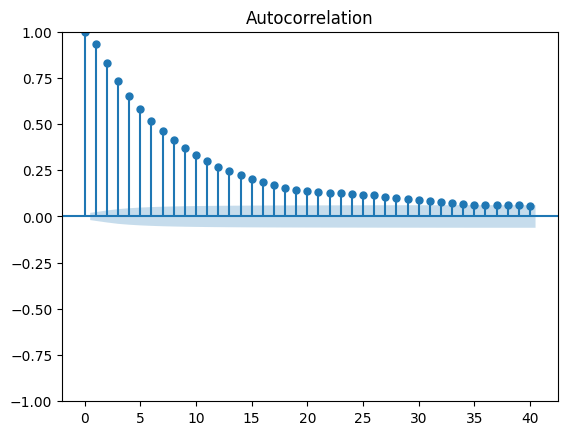
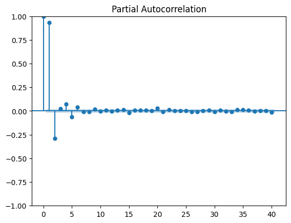
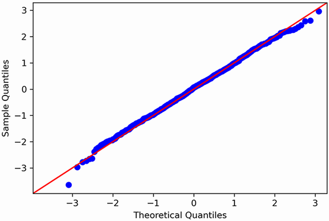
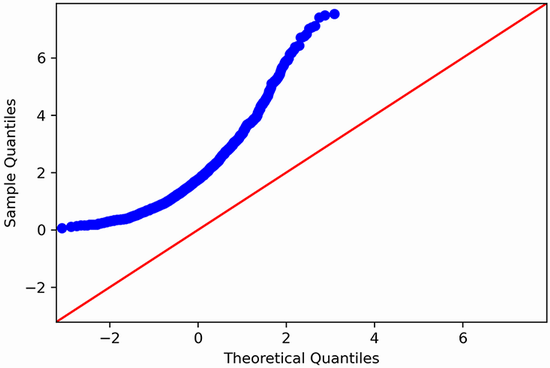

# Autoregressive Moving Average (ARMA)

- The autoregressive moving average model, denoted as $ARMA(p,q)$, is the combination of the autoregressive model $AR(p)$ and the moving average model $MA(q)$.
- An ARMA(p,q) process will display a **decaying pattern** or a **sinusoidal** pattern on _both the ACF and PACF_ plots.
  - Therefore, they cannot be used to estimate the orders $p$ and $q$.

| ACF plot exhibits a **decaying pattern** | PACF plot exhibits a **sinusoidal** pattern |
| :--------------------------------------: | :-----------------------------------------: |
|   |     |

<p align="center">General modeling procedure for an ARMA(p, q) process<br></p>

- The **general modeling procedure** does not rely on the ACF and PACF plots. Instead, we fit many ARMA(p,q) models and perform model selection and residual analysis.

  - **Model selection** is done with the Akaike information criterion (AIC).
    - AIC quantifies the information loss of a model, and it is related to the number of parameters in a model and its goodness of fit. _The lower the AIC, the better the model_.
  - **Residual analysis** on the best model selected based on model selection - The **residuals** of a model are simply the difference between the predicted values and the actual values.
    - The qualitative analysis with **Q-Q plot** which is a graphical tool for comparing two distributions. We use it to compare the distribution of the _residuals_ against a theoretical _normal_ distribution.
      - If the plot shows a straight line that lies on y = x, then the residuals are **normally distributed**.
      - Otherwise, it means that the residuals are not normally distributed.
    - The quantitative analysis with **Ljung-Box** test which allows us to determine whether the residuals are _correlated_ or not.
      - The null hypothesis states that the data is independently distributed and uncorrelated.
        - If the returned p-values are larger than 0.05, we cannot reject the null hypothesis, meaning that the residuals are uncorrelated, just like white noise.

- Forecasting a time series using the ARMA(p,q) model identified from the previous **general modeling procedure**
  - _Note 1_: ARMA model assumes stationarity, so if the process is not stationary, the model has to be trained and testes on its stationary **differenced series**
  - _Note 2_: Once the champion model is identify on the stationary series, so we need to inverse-transform our predictions to bring them back to the original scale of the untransformed dataset by taking the cumulative sum of our predictions and add it to the last value of our training set in the original series.

## Introduction

- The autoregressive moving average process $ARMA(p,q)$ is a combination of the autoregressive process and the moving average process.
- The $ARMA(p,q)$ process is expressed as a linear combination of
  - On its own previous values $y_{t-p}$ and a constant $C$, just like in an _autoregressive_ process
  - On the mean of the series $\mu$, the current error term $\epsilon_t$, and past error terms $\epsilon_{t-q}$, like in a _moving average_ process.

$$y_t = C + \varphi_1y_{t–1} + \varphi_2y_{t–2} +⋅⋅⋅+ \varphi_p y_{t–p} + \mu + \epsilon_t + \theta_1\epsilon_{t-1} + ... + \theta_q\epsilon_{t-q}$$

### Simulating an ARMA process

- Simulate an ARMA(1,1) process with the below equation.
  - This is equivalent to combining an MA(1) process with an AR(1) process.
    $$y_t = 0.33y_{t-1} + 0.9\epsilon_{t-1} + \epsilon_t$$
- Use the `ArmaProcess` function from the `statsmodels` library to simulate our ARMA(1,1) process.
  - $AR(1)$ process will have a coefficient of 0.33.
    - However, the function expects to have the coefficient of the autoregressive process with its opposite sign, so it is –0.33.
  - $MA(1)$ process will have a coefficient is 0.9
  - **Note**: when defining your arrays of coefficients, the first coefficient is always equal to 1, as specified by the library, which represents the coefficient at lag 0.

```Python
import numpy as np
from statsmodels.tsa.arima_process import ArmaProcess

ar1 = np.array([1, -0.33])
ma1 = np.array([1, 0.9])

ARMA_1_1 = ArmaProcess(ar1, ma1).generate_sample(nsample=1000)
```

## Identifying a stationary ARMA process

<p align="center"><br>Steps to identify a random walk, a moving average process MA(q), an autoregressive process AR(p), and an autoregressive moving average process ARMA(p, q)</p>

- If neither of the ACF and PACF plots shows a clear cutoff between significant and non-significant coefficients, then we have an ARMA(p,q) process.

```Python
import pandas as pd

df = pd.read_csv("../../data/book-time-series-forecasting-in-python/bandwidth.csv")
```

- _Step 1_: Test for stationarity.
  - If our series is not stationary, we apply transformations, such as differencing, until the series is stationary.

```Python
from statsmodels.graphics.tsaplots import plot_acf, plot_pacf
def check_stationarity(series, p_significant=0.05):
    # Copied from https://machinelearningmastery.com/time-series-data-stationary-python/

    adfuller_result = adfuller(series)
    kpss_result = kpss(series)

    print(f'ADF Statistic : {adfuller_result[0]:.5f}, p-value: {adfuller_result[1]:.5f}')
    print('Critical Values:')
    for key, value in adfuller_result[4].items():
        print('\t%s: %.3f' % (key, value))
    print(f'KPSS Statistic: {kpss_result[0]:.5f}, p-value: {kpss_result[1]:.5f}')
    if (adfuller_result[1] <= p_significant) & (adfuller_result[4]['5%'] > adfuller_result[0]) & (kpss_result[1] > p_significant):
        print("\u001b[32mStationary\u001b[0m")
    else:
        print("\x1b[31mNon-stationary\x1b[0m")

check_stationarity(df["hourly_bandwidth"])
# The time series is not stationary.
# Apply a transformation to our data in order to make it stationary. Let’s apply a first-order differencing using numpy.
bandwidth_diff = np.diff(df.hourly_bandwidth, n=1)
check_stationarity(bandwidth_diff)
```

- _Step 2_: Plot the ACF on the stationary version of the series and see if there is autocorrelation and if the coefficients become abruptly non-significant after a certain lag (MA process), or the ACF plot exhibits a slowly decaying pattern or sinusoidal pattern (ARMA process)

```Python
from statsmodels.graphics.tsaplots import plot_acf
# plot acf on the first-order differencing series as it is stationary instead of the original data.
plot_acf(bandwidth_diff);
```

<p align="center"><br>ACF plot of stationary ARMA process</p>

- The ACF plot exhibits a slowly decaying pattern, so it is difficult to conclude from the ACF if the (differenced) stationary series is MA(q) process.

- _Step 3_: Plot the PACF on the stationary version of the series

```Python
from statsmodels.graphics.tsaplots import plot_pacf
# plot acf on the first-order differencing series as it is stationary instead of the original data.
plot_pacf(bandwidth_diff);
```

<p align="center"><br>PACF plot of stationary ARMA process</p>

- From the PACF plot, there is a clear sinusoidal pattern, meaning that we cannot infer a value for the order $p$.
- If your process is stationary and both the ACF and PACF plots show a decaying or sinusoidal pattern, then it is a stationary ARMA(p,q) process.
- Since the ACF and PACF plots are not useful in the case of an ARMA(p,q) process, we must thus devise a general modeling procedure that will allow us to find the appropriate combination of (p,q) for our model.

## General Modeling Procedure

- Neither ACF nor PACF plot was useful for determining the orders p and q, so we rely entirely on a model selection criterion and residual analysis.

<p align="center"><br>General modeling procedure for an ARMA(p, q) process.</p>

- _Step 1_: Test for stationarity, and apply transformations accordingly.
- _Step 2_: List different possible values of p and q
- _Step 3_: Fit every unique combination of ARMA(p,q) to our data.
  - Compute the Akaike information criterion (AIC) & the model with the lowest AIC is then selected.
- _Step 4_: perform the residual analysis (the difference between the actual and predicted values of the model) by looking at
  - The quantile-quantile plot (Q-Q plot): to check if the residuals are normally distributed
  - The residual correlogram. (Ljung-Box test): to check if the residuals are uncorrelated.
  - **Note**: a good model has residuals that are similar to white noise, so the residuals should be normally distributed and uncorrelated.
- If the analysis leads us to conclude that the residuals are completely random, we have a model ready for forecasting.
- Otherwise, we must try a different set of values for p and q and start the process over.

### Akaike information criterion (AIC) in Model Selection

- Given that there will be some information lost when a model is fitted to the data, the AIC quantifies the relative amount of information lost by the model.
- The less information lost, the lower the AIC value and the better the model.

```Python
from statsmodels.tsa.statespace.sarimax import SARIMAX

from tqdm import tqdm
from typing import Union

# fit all unique 16 ARMA(p,q) models to the data
def optimize_ARMA(endog: Union[pd.Series, list], order_list: list) -> pd.DataFrame:

    results = []

    for order in tqdm(order_list):
        try:
            p, q = order
            model = SARIMAX(endog,
                            order=(p, 0, q),
                            simple_differencing=False # prevent differencing.
                            ).fit(disp=False) # avoid printing convergence messages to the console.
        except:
            continue
        # calculate the model’s AIC.
        aic = model.aic
        results.append([order, aic])

    result_df = pd.DataFrame(results)
    result_df.columns = ['(p,q)', 'AIC']

    #Sort in ascending order, lower AIC is better
    result_df = result_df.sort_values(by='AIC', ascending=True).reset_index(drop=True)

    return result_df
```

- With our train set ready, we can now fit different $ARMA(p,q)$ models using the `optimize_ARMA` function.
- The `optimize_ARMA` function takes the training data and the list of unique (p,q) combinations as input, and then we iterate over each (p,q) combination and fit an ARMA(p,q) model on our data.
- We compute the AIC, store the result, and sort by AIC value in ascending order as the lower the AIC, the better the model.

```Python
from itertools import product
# define a list of (p, q)
ps = range(0, 4, 1)    # The order p can have the values {0,1,2,3}
qs = range(0, 4, 1)    # The order q can have the values {0,1,2,3}

order_list = list(product(ps, qs))

result_df = optimize_ARMA(train['bandwidth_diff'], order_list)
result_df.head()

# 	 (p,q)	    AIC
# 0	(3, 2)	27991.063879
# 1	(2, 3)	27991.287509
# 2	(2, 2)	27991.603598
# 3	(3, 3)	27993.416924
# 4	(1, 3)	28003.349550
```

- The first three models all have an AIC of 27,991, with only slight differences.
- In this case, ARMA(2,2) model is selected as its AIC value is very close to the ARMA(3,2) and ARMA(2,3) models, while being less complex

### Residual Analysis

- The **residuals** of a model are simply the difference between the predicted values and the actual values.

#### Qualitative analysis: Studying the Q-Q plot

- The first step in residual analysis is the study of the quantile-quantile plot (Q-Q plot).
- The Q-Q plot is a graphical tool for verifying our **hypothesis that the model’s residuals are normally distributed** because we want the residuals to be similar to white noise, which is normally distributed.

| Q-Q plot of residuals that are very close to a normal distribution |      Q-Q plot of residuals that are not close to a normal distribution.      |
| :----------------------------------------------------------------: | :--------------------------------------------------------------------------: |
|    |  |

- The Q-Q plot is constructed by plotting the quantiles of our residuals on the y-axis against the quantiles of a theoretical distribution, in this case the normal distribution, on the x-axis.
  - If both distributions are similar, meaning that the distribution of the residuals is close to a normal distribution, the Q-Q plot will display a straight line that approximately lies on y = x.
  - If both distributions are not similar, meaning that the distribution of the residuals is not close to a normal distribution, the Q-Q plot will generate the curve that departs from y = x.

```Python
# - To perform the residual analysis, we’ll fit the ARMA(2,2) model on our training set.
# - Use the `plot_diagnostics` method to study the Q-Q plot
model = SARIMAX(train['bandwidth_diff'],
                order=(2,0,2),
                simple_differencing=False)
model_fit = model.fit(disp=False)
print(model_fit.summary())

model_fit.plot_diagnostics(figsize=(10, 8));
```

<p align="center"><br>Plots generated from plot_diagnostics function of statsmodel</p>

- The top-left plot shows no trend, and the mean seems constant over time, meaning that our residuals are likely **stationary**.
- The top right displays a density plot with a shape similar to that of a **normal distribution**.
- The Q-Q plot at the bottom left shows a thick straight line that is very close to y = x.
- The ACF plot at the bottom right shows **no autocorrelation** after lag 0.
- **Summary**: the above figures indicates that our residuals clearly resemble **white noise**, since they are _normally_ distributed and _uncorrelated_.

#### Quantitative analysis: Applying the Ljung-Box test

- Once we have analyzed the Q-Q plot and determined that our residuals are approximately normally distributed, we can then apply the Ljung-Box test to demonstrate that the residuals are uncorrelated.
- Note: a good model has residuals that are similar to white noise, so the residuals should be normally distributed and uncorrelated.
- The Ljung-Box test is a statistical test that determines whether the autocorrelation of a group of data is significantly different from 0.
  - In time series forecasting, we apply the Ljung-Box test on the model’s residuals to test whether they are similar to white noise.
  - The null hypothesis states that the data is independently distributed, meaning that there is no autocorrelation.
  - If the p-value is > 0.05, we cannot reject the null hypothesis, meaning that the residuals are independently distributed.
    - Therefore, there is no autocorrelation, the residuals are similar to white noise, and the model can be used for forecasting.
  - If the p-value is < 0.05, we reject the null hypothesis, meaning that our residuals are not independently distributed and are correlated. The model cannot be used for forecasting.

```Python
residuals = model_fit.resid
jb_df = acorr_ljungbox(residuals, np.arange(1, 11, 1))
(jb_df["lb_pvalue"] >= 0.05).sum() == 10 # True, this to ensure all the lags, the p-value exceed 0.05, so we cannot reject the null hypo
```

- The resulting list of p-values shows that each is above 0.05.
- Therefore, at each lag, the null hypothesis cannot be rejected, meaning that the residuals are independently distributed and uncorrelated.
- Our ARMA(2,2) model has passed all the checks on the residual analysis, and we are ready to use this model to forecast bandwidth usage.

## Forecasting bandwidth usage

- Use `rolling_forecast` function to evaluate the performance of the different forecasting methods.
- We will predict `window=2` steps at a time as per this problem.

```Python
def rolling_forecast(df: pd.DataFrame, train_len: int, horizon: int, window: int, method: str) -> list:

    total_len = train_len + horizon

    if method == 'mean':
        pred_mean = []

        for i in range(train_len, total_len, window):
            mean = np.mean(df[:i].values)
            pred_mean.extend(mean for _ in range(window))

        return pred_mean

    elif method == 'last':
        pred_last_value = []

        for i in range(train_len, total_len, window):
            last_value = df[:i].iloc[-1].values[0]
            pred_last_value.extend(last_value for _ in range(window))

        return pred_last_value

    elif method == 'ARMA':
        pred_ARMA = []

        for i in range(train_len, total_len, window):
            model = SARIMAX(df[:i], order=(2,0,2))
            res = model.fit(disp=False)
            predictions = res.get_prediction(0, i + window - 1)
            oos_pred = predictions.predicted_mean.iloc[-window:]
            pred_ARMA.extend(oos_pred)

        return pred_ARMA

TRAIN_LEN = len(train)
HORIZON = len(test)
WINDOW = 2 # 2 steps at the time for the prediction

pred_mean = rolling_forecast(df_diff, TRAIN_LEN, HORIZON, WINDOW, 'mean')
pred_last_value = rolling_forecast(df_diff, TRAIN_LEN, HORIZON, WINDOW, 'last')
pred_ARMA = rolling_forecast(df_diff, TRAIN_LEN, HORIZON, WINDOW, 'ARMA')

test.loc[:, 'pred_mean'] = pred_mean
test.loc[:, 'pred_last_value'] = pred_last_value
test.loc[:, 'pred_ARMA'] = pred_ARMA


mse_mean = mean_squared_error(test['bandwidth_diff'], test['pred_mean'])
mse_last = mean_squared_error(test['bandwidth_diff'], test['pred_last_value'])
mse_ARMA = mean_squared_error(test['bandwidth_diff'], test['pred_ARMA'])

print(mse_mean, mse_last, mse_ARMA)
# 6.306526957989325 2.2297582947733656 1.7690462114206054
```

- The ARMA(2,2) model (MSE=1.769) outperforms the benchmarks: mean method (MSE=6.3) and last known value (MSE=2.2)
- The final step is to reverse the transformation of our forecast in order to bring it to the same scale as our original data

```Python
df['pred_bandwidth'] = pd.Series()
df['pred_bandwidth'][9832:] = df['hourly_bandwidth'].iloc[9831] + test['pred_ARMA'].cumsum()

mae_ARMA_undiff = mean_absolute_error(df['hourly_bandwidth'][9832:], df['pred_bandwidth'][9832:])

print(mae_ARMA_undiff) # 8.4
```

- On average, our forecasts are 8.4 Mbps above or below the actual bandwidth usage
