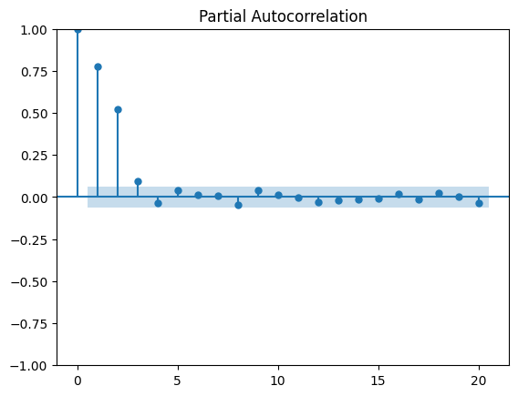

# Autoregressive (AR) Model

- Defining an autoregressive process: denoted as $AR(p)$, is the process where the present value $y_t$ is linearly dependent on its past values from $y_{t–1}$ to $y_{t–p}$.
- Identifying AR process & the order of AR model
  - In the case where the autocorrelation coefficients in ACF _slowly decay_ or exhibit a _sinusoidal_ pattern, then you are possibly in the presence of an **autoregressive** process.
  - This time we will have to plot the Partial Autocorrelation function (PACF) and see at which lag the coefficients suddenly become non-significant.
  <p align="center"><br>Steps to identify the order of an autoregressive (AR) process</p>
- Defining the partial autocorrelation function (PACF):
  - Suppose we have the following AR(2) process: $y_t = 0.33y_{t–1} + 0.50y_{t–2}$
  - In order to measure the correlation between $y_t$ and $y_{t-2}$,
    - Autocorrelation function (`ACF`) will capture both:
      - **Direct** impact of $y_{t-2}$ on $y_t$:
        - i.e: $y_{t-2}$ &#8594; $y_t$
      - **In-direct** impact of $y_{t-2}$ on $y_t$ via $y_{t-1}$:
        - i.e: $y_{t-2}$ &#8594; $y_{t-1}$ &#8594; $y_t$
        - This is because the $y_{t-2}$ also influencs on $y_{t-1}$ and $y_{t-1}$ then influences $y_t$
    - Partial Autocorrelation fuction (`PACF`) measures only the **direct** impact between each lag value, say $y_{t-2}$, and the $y_t$ and remove the influence of correlated lagged values, say $y_{t-1}$, in between (a.k.a. _confounding variables_)
- Using the PACF plot to determine the order $p$ of a stationary $AR(p)$ process: the **coefficients will be non-significant** after lag $p$.
- Forecasting a time series using the autoregressive model
  - _Note 1_: AR model assumes stationarity, so if the process is not stationary, the model has to be trained and testes on its stationary **differenced series**
  - _Note 2_: Once the champion model is identify on the stationary series, so we need to inverse-transform our predictions to bring them back to the original scale of the untransformed dataset by taking the cumulative sum of our predictions and add it to the last value of our training set in the original series.

## Introduction

- An autoregressive process, denoted as $AR(p)$, is the process where the present value is linearly dependent on its past values. (or a regression of the variable against itself)
- In AR process, the present value $y_t$ is a linear combination of:
  - A constant $C$
  - The present error term $\epsilon_t$, which is also white noise
  - The past values of the series $y_{t–p}$.
    - The magnitude of the influence of the past values on the present value is denoted as $\varphi_p$, which represents the coefficients of the $AR(p)$ model

$$y_t = C + \epsilon_t + \varphi_1y_{t–1} + \varphi_2y_{t–2} +⋅⋅⋅+ \varphi_p y_{t–p}$$

- Note 1: The order $p$ of an autoregressive process determines the number of past values that affect the present value.
- Note 2: The random walk is a **special case of an autoregressive process**, where the order $p$ is 1 and $\varphi_1$ is equal to 1.
  - $y_t = C + \epsilon_t + y_{t-1}$

### Simulating an AR process

- Suppose we have the following AR(2) process: $y_t = 0.33y_{t–1} + 0.50y_{t–2}$
- We will simulate it using the `ArmaProcess` function from `statsmodels`.
  - The function expects
    - An array containing the coefficients of an $MA(q)$ process.
      - Since we are only interested in simulating an $AR(2)$ process, we will set the coefficients of the $MA(q)$ process to 0
    - An array containing the coefficients for an $AR(p)$ process.
      - The coefficients of the AR(2) process must have **opposite signs** to those we wish to simulate. In this example, the array will contain `–0.33` and `–0.50`.
    - An coefficient at lag 0, which is the number that multiplies $y_t$ which is 1.

```Python
ma2 = np.array([1, 0, 0])
ar2 = np.array([1, -0.33, -0.50])

AR2_process = ArmaProcess(ar2, ma2).generate_sample(nsample=1000)
```

## Identifying AR process & the order of AR model

<p align="center"><br>Steps to identify the order of an autoregressive (AR) process</p>

```Python
import pandas as pd

df = pd.read_csv("../../data/book-time-series-forecasting-in-python/foot_traffic.csv")
```

- _Step 1_: Test for stationarity.
  - If our series is not stationary, we apply transformations, such as differencing, until the series is stationary.

```Python
from statsmodels.graphics.tsaplots import plot_acf, plot_pacf
def check_stationarity(series, p_significant=0.05):
    # Copied from https://machinelearningmastery.com/time-series-data-stationary-python/

    adfuller_result = adfuller(series)
    kpss_result = kpss(series)

    print(f'ADF Statistic : {adfuller_result[0]:.5f}, p-value: {adfuller_result[1]:.5f}')
    print('Critical Values:')
    for key, value in adfuller_result[4].items():
        print('\t%s: %.3f' % (key, value))
    print(f'KPSS Statistic: {kpss_result[0]:.5f}, p-value: {kpss_result[1]:.5f}')
    if (adfuller_result[1] <= p_significant) & (adfuller_result[4]['5%'] > adfuller_result[0]) & (kpss_result[1] > p_significant):
        print("\u001b[32mStationary\u001b[0m")
    else:
        print("\x1b[31mNon-stationary\x1b[0m")

check_stationarity(df['foot_traffic']) # not stationary
# we must apply a transformation to make it stationary.
foot_traffic_diff = np.diff(df['foot_traffic'], n=1)
check_stationarity(foot_traffic_diff) # stationary after the first differencing
```

- _Step 2_: Plot the ACF on the stationary version of the series and see if there is autocorrelation and if the coefficients become abruptly non-significant after a certain lag
  - When the ACF plot of a stationary process exhibits _a pattern of exponential decay_, we probably have an **autoregressive** process in play, and we must find another way to identify the order $p$ of the $AR(p)$ process
  - In an attempt to identify the **order** of a stationary autoregressive process, unfortunately, the **ACF** plot cannot give us this information, and we must turn to the partial autocorrelation function (**PACF**).

```Python
from statsmodels.graphics.tsaplots import plot_acf
# plot acf on the first-order differencing series as it is stationary instead of the original data.
plot_acf(foot_traffic_diff, lags=30);
```

<p align="center"><br>The plot is slowly decaying which is indicative of an autoregressive process.</p>

- _Step 3_: Plot the `PACF` to determine the order $p$ of a stationary $AR(p)$ process.
  - The coefficients are non-significant after lag 3.
  - Therefore, we can say that our stationary process is a third-order autoregressive process, or an $AR(3)$ process.

```Python
from statsmodels.graphics.tsaplots import plot_pacf
# plot pacf on the first-order differencing series as it is stationary instead of the original data.
plot_pacf(foot_traffic_diff, lags=20);
```

<p align="center"><br>PACF plot on the stationary process of AR(3)</p>

## Forecasting an autoregressive process

- Train-test split

```Python
# hold out the last 52 weeks of data for our test set, while the rest will be used for training.
df_diff = pd.DataFrame({'foot_traffic_diff': foot_traffic_diff})

train = df_diff[:-52]
test = df_diff[-52:]

print(len(train))
print(len(test))
```

- Use the `SARIMAX` function from `statsmodels` from statsmodels as it encompasses an AR model.
- `SARIMAX` is a complex model that allows us to consider
  - Seasonal effects
  - Autoregressive processes
  - Non-stationary time series
  - Moving average processes
  - Exogenous variables
- **Rolling forecast function `rolling_forecast`**: the prediction loop starts at the end of the training set and continues until `total_len`, each pass in the loop, the model will predict `window` values, and then re-fit model with addtional `window` steps before predicting the next `window` values.
  - The `train_len` parameter is the size of training set
  - The `horizon` parameter is equal to the length of the test set and represents how many values must be predicted.
  - The `window` parameter specifies how many timesteps are predicted at a time.
  - The `method` parameter specifies what model to use: Naive methods and the AR(p) model.

```Python
def rolling_forecast(df: pd.DataFrame, train_len: int, horizon: int,  window: int, method: str, p: int = 0) -> list:

    total_len = train_len + horizon
    # end_idx = train_len

    if method == 'mean':
        pred_mean = []

        for i in range(train_len, total_len, window):
            mean = np.mean(df[:i].values)
            pred_mean.extend(mean for _ in range(window))

        return pred_mean

    elif method == 'last':
        pred_last_value = []

        for i in range(train_len, total_len, window):
            last_value = df[:i].iloc[-1].values[0]
            pred_last_value.extend(last_value for _ in range(window))

        return pred_last_value

    elif method == 'AR':
        pred_AR = []

        for i in range(train_len, total_len, window):
            model = SARIMAX(df[:i], order=(p,0,0))
            res = model.fit(disp=False)
            predictions = res.get_prediction(0, i + window - 1)
            oos_pred = predictions.predicted_mean.iloc[-window:]
            pred_AR.extend(oos_pred)

        return pred_AR
```

- Apply the rolling_forecast function to different modeling methods and compare the result

```Python
TRAIN_LEN = len(train)
HORIZON = len(test)
WINDOW = 1   # only with 1 forecast at the same time

pred_mean = rolling_forecast(df_diff, TRAIN_LEN, HORIZON, WINDOW, 'mean')
pred_last_value = rolling_forecast(df_diff, TRAIN_LEN, HORIZON, WINDOW, 'last')
pred_AR = rolling_forecast(df_diff, TRAIN_LEN, HORIZON, WINDOW, 'AR', 3)

test['pred_mean'] = pred_mean
test['pred_last_value'] = pred_last_value
test['pred_AR'] = pred_AR

from sklearn.metrics import mean_squared_error
mse_mean = mean_squared_error(test['foot_traffic_diff'], test['pred_mean'])
mse_last = mean_squared_error(test['foot_traffic_diff'], test['pred_last_value'])
mse_AR = mean_squared_error(test['foot_traffic_diff'], test['pred_AR'])
# 3.1079979374701447 1.448730118495964 0.9242479169193074
```

- Since the MSE for the $AR(3)$ model is the lowest of the three, we conclude that the $AR(3)$ model is the best-performing method for forecasting next week’s average foot traffic.
- Next step: to bring our forecasts back to the original scale of the data
  - To do this, we can take the cumulative sum of our predictions and add it to the last value of our training set in the original series.

```Python
df['pred_foot_traffic'] = pd.Series()
df['pred_foot_traffic'][948:] = df['foot_traffic'].iloc[947] + test['pred_AR'].cumsum() # df.iloc[947] is the last value in the training set

from sklearn.metrics import mean_absolute_error
mae_AR_undiff = mean_absolute_error(df['foot_traffic'][948:], df['pred_foot_traffic'][948:])
print(mae_AR_undiff) # 2.87
```

- This means that our predictions are off by 2.87 people on average, either above or below the actual value for the week’s foot traffic.
