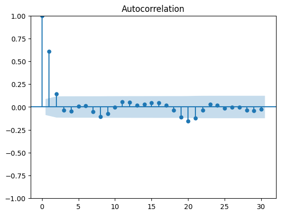

# Moving Average (MA) Model

- Defining a moving average process $MA(q)$: expresses the present value as a linear combination of
  - The **mean** of the series ($\mu$)
  - The _current_ ($\epsilon_t$) & _past_ ($\epsilon_{t-q}$) **error terms**
    - Those error terms are assumed to be _mutually independent_ and _normally distributed_, just like white noise.
    - The _magnitude of the impact_ of **past errors on the present value** is quantified using a coefficient denoted as ($\theta_q$).
      $$y_t = \mu + \epsilon_t + \theta_1\epsilon_{t-1} + ... + \theta_q\epsilon_{t-q}$$
  - Note 1: The order $q$ of the moving average model determines the number of past error terms that affect the present value.
- Checking stationary & using the ACF to identify the order of a moving average process
<p align="center"><br>Steps to identify the order of a moving average (MA) process</p>

- Forecasting a time series using the moving average model
  - _Note 1_: MA model assumes stationarity, so if the process is not stationary, the model has to be trained and testes on its stationary **differenced series**
  - _Note 2_: $MA(q)$ model can only forecast $q$ steps into the future
  - _Note 3_: Once the champion model is identify on the stationary series, so we need to inverse-transform our predictions to bring them back to the original scale of the untransformed dataset.
    - In order to reverse our first-order difference to the original scale,
      - For $y_1$, we need to add an initial value $y_0$ to the first differenced value $y_1'$.
      - For $y_2$, we need to add an initial value $y_0$ with a cumulative sum of the differenced values (i.e. sum of $y_1'$ and $y_2'$)
        $$y_1 = y_0 + y_1' = y_0 + y_1– y_0 = y_1$$
        $$y_2 = y_0 + y_1' + y_2' = y_0 + y_1– y_0 + y_2– y_1 = (y_0– y_0) + (y_1– y_1) + y_2 = y_2$$

<p align="center"><br>Visualizing a first-order difference</p>

## Introduction

- Moving Average (MA) model, denoted as $MA(q)$ where $q$ is the order, expresses the present value as a linear combination of
  - The **mean** of the series ($\mu$)
  - The _current_ ($\epsilon_t$) & _past_ ($\epsilon_{t-q}$) **error terms**
    - Those error terms are assumed to be _mutually independent_ and _normally distributed_, just like white noise.
    - The _magnitude of the impact_ of **past errors on the present value** is quantified using a coefficient denoted as ($\theta_q$).
      $$y_t = \mu + \epsilon_t + \theta_1\epsilon_{t-1} + ... + \theta_q\epsilon_{t-q}$$
  - Note 1: The order $q$ of the moving average model determines the number of past error terms that affect the present value.
  - Note 2: The $MA(q)$ model is **only able to forecast $q$ steps into the future** as it is linearly dependent on $q$ past error terms.

### Simulating an MA process

- Simulate an $MA(3)$ process with the mean $\mu=0$ and current error term $\epsilon_t=0$ are zeros
  - $y_t = 0.9\theta_{t–1} + 0.3\theta_{t–2} + 0.2\theta_{t–3}$
- We will simulate it using the `ArmaProcess` function from `statsmodels`.
  - The function expects
    - An array containing the coefficients of an $MA(q)$ process
    - An array containing the coefficients for an $AR(p)$ process.
      - Since we are only interested in simulating an $MA(3)$ process, we will set the coefficients of the $AR(p)$ process to 0.
    - An coefficient at lag 0, which is the number that multiplies $y_t$ which is 1.

```Python
from statsmodels.tsa.arima_process import ArmaProcess
# MA(3)
ma3 = np.array([1, 0.9, 0.3, 0.2]) # yt = 0.9 * theta(t-1) + 0.3 * theta(t-2) + 0.2* theta(t-3)
ar3 = np.array([1,  0,    0,  0])

MA3_process = ArmaProcess(ar3, ma3).generate_sample(nsample=10000)
```

## Identifying MA process & the order of MA model

<p align="center"><br>Steps to identify the order of a moving average (MA) process</p>

- _Step 1_: Test for stationarity.
  - If our series is not stationary, we apply transformations, such as differencing, until the series is stationary.
- _Step 2_: Plot the ACF and look for significant autocorrelation coefficients.
  - In the case of a random walk, we will not see significant coefficients after lag 0.
  - If we see significant coefficients, we must check whether they become abruptly non-significant after some lag $q$.
    - If that is the case, then we know that we have a moving average process of order $q$.
  - Otherwise, we must follow a different set of steps to discover the underlying process of our time series.

## Forecasting a moving average process

- The moving average model assumes stationarity, meaning that our forecasts must be done on a stationary time series.
  - Therefore, we will train and test our model on the **differenced volume of widget sales**
- The moving average model is linearly dependent on past error terms, this means that for an $MA(q)$ model, we can only forecast $q$ steps into the future.
  - Any prediction made beyond that point will not have past error terms, and the model will only predict the mean, which is equivalent to a baseline model.
- **Rolling forecast function `rolling_forecast`**: the prediction loop starts at the end of the training set and continues until `total_len`, each pass in the loop, the model will predict `window` values (in this MA(2) example will be 2 forecasts), and then re-fit model with addtional `window` steps before predicting the next `window` values.
  - The `train_len` parameter is the size of training set
  - The `horizon` parameter is equal to the length of the test set and represents how many values must be predicted.
  - The `window` parameter specifies how many timesteps are predicted at a time.
    - In our case, because we have an $MA(2)$ process, the window will be equal to 2.
  - The `method` parameter specifies what model to use: Naive methods and the MA(2) model.

```Python
from statsmodels.tsa.statespace.sarimax import SARIMAX
# MA(q) model is part of the more complex SARIMAX model

def rolling_forecast(df: pd.DataFrame,
                     train_len: int, # training length
                     horizon: int,   # horizon of the forecast
                     window: int,    # how many steps to forecast
                     method: str) -> list:
    total_len = train_len + horizon

    if method == 'mean':
        pred_mean = []
        for i in range(train_len, total_len, window):
            mean = np.mean(df[:i].values)
            pred_mean.extend(mean for _ in range(window))
        return pred_mean

    if method == 'last':
        pred_last_value = []
        for i in range(train_len, total_len, window):
            last_value = df[:i].iloc[-1].values[0]
            pred_last_value.extend(last_value for _ in range(window))
        return pred_last_value

    elif method == 'MA':
        pred_MA = []
        for i in range(train_len, total_len, window):
            model = SARIMAX(df[:i], order=(0,0, window))  # MA(2) as window=2
            res = model.fit(disp=False)
            predictions = res.get_prediction(0, i + window - 1) # forecast to the next "window" steps
            # "predicted_mean" method allows us to retrieve the actual value of the forecast
            # as defined by the statsmodels library.
            oos_pred = predictions.predicted_mean.iloc[-window:]
            pred_MA.extend(oos_pred)

        return pred_MA
```

- Once the champion model is identify on the stationary series, so we need to inverse-transform our predictions to bring them back to the original scale of the untransformed dataset.
- In order to reverse our first-order difference to the original scale,
  - For $y_1$, we need to add an initial value $y_0$ to the first differenced value $y_1'$.
  - For $y_2$, we need to add an initial value $y_0$ with a cumulative sum of the differenced values (i.e. sum of $y_1'$ and $y_2'$)
    $$y_1 = y_0 + y_1' = y_0 + y_1– y_0 = y_1$$
    $$y_2 = y_0 + y_1' + y_2' = y_0 + y_1– y_0 + y_2– y_1 = (y_0– y_0) + (y_1– y_1) + y_2 = y_2$$

<p align="center"><br>Visualizing a first-order difference</p>

## Example of MA modeling

- **Goal of the example**: to forecast the volume of widget sales so that the company will be able to better manage its production of widgets and avoid producing too many or too few.
- **Timeline**: the sales of widgets over 500 days starting in 2019

```Python
import pandas as pd
import plotly.express as px

df = pd.read_csv("../../data/book-time-series-forecasting-in-python/widget_sales.csv")
```

### EDA to identify the MA process and its order

- Check for the stationary:

```Python
def check_stationarity(series, p_significant=0.05):
    # Copied from https://machinelearningmastery.com/time-series-data-stationary-python/

    adfuller_result = adfuller(series)
    kpss_result = kpss(series)

    print(f'ADF Statistic : {adfuller_result[0]:.5f}, p-value: {adfuller_result[1]:.5f}')
    print('Critical Values:')
    for key, value in adfuller_result[4].items():
        print('\t%s: %.3f' % (key, value))
    print(f'KPSS Statistic: {kpss_result[0]:.5f}, p-value: {kpss_result[1]:.5f}')
    if (adfuller_result[1] <= p_significant) & (adfuller_result[4]['5%'] > adfuller_result[0]) & (kpss_result[1] > p_significant):
        print("\u001b[32mStationary\u001b[0m")
    else:
        print("\x1b[31mNon-stationary\x1b[0m")

check_stationarity(df['widget_sales'])
# ADF Statistic : -1.51217, p-value: 0.52748
# Critical Values:
# 	1%: -3.444
# 	5%: -2.867
# 	10%: -2.570
# KPSS Statistic: 2.87187, p-value: 0.01000
# Non-stationary
```

- The time series is not stationary, so we try to stabilize the trend by applying a first-order differencing.

```Python
widget_sales_diff = np.diff(df['widget_sales'], n=1)
check_stationarity(widget_sales_diff)
# ADF Statistic : -10.57666, p-value: 0.00000
# Critical Values:
# 	1%: -3.444
# 	5%: -2.867
# 	10%: -2.570
# KPSS Statistic: 0.12472, p-value: 0.10000
# Stationary
```

- Check for correlation on the differenced time series `widget_sales_diff` as it is stationary using ACF plot:
  - From the ACF plot, there are significant coefficients up until lag 2. Then they abruptly become non-significant, as they remain in the shaded area of the plot.
  - This means that we have a stationary MA process of order 2 (i.e. $MA(2)$)

```Python
from statsmodels.graphics.tsaplots import plot_acf

plot_acf(widget_sales_diff, lags=30);
```

<p align="center"><br>ACF Plot of The Differenced Time Series</p>

### Forecasting with baseline & MA models

- Preparing the train-test split based on the differenced time series

```Python
df_diff = pd.DataFrame({'widget_sales_diff': widget_sales_diff})

train = df_diff[:int(0.9*len(df_diff))] # df_dff[:449]
test = df_diff[int(0.9*len(df_diff)):]  # df_diff[499:]
print(len(train))
print(len(test))
```

- Preparing the parameters required for the rolling forecast function

```Python
pred_df = test.copy()

TRAIN_LEN = len(train) # train set len
HORIZON = len(test)    # test set len
WINDOW = 2             # how many steps MA model can predict
```

- Calling the `rolling_forecast` function with different methods (models)

```Python
pred_mean = rolling_forecast(df_diff, TRAIN_LEN, HORIZON, WINDOW, 'mean') # naive model
pred_last_value = rolling_forecast(df_diff, TRAIN_LEN, HORIZON, WINDOW, 'last') # naive model
pred_MA = rolling_forecast(df_diff, TRAIN_LEN, HORIZON, WINDOW, 'MA') # MA(2)

pred_df['pred_mean'] = pred_mean
pred_df['pred_last_value'] = pred_last_value
pred_df['pred_MA'] = pred_MA

# measure the performance of our models using MSE
mse_mean = mean_squared_error(pred_df['widget_sales_diff'], pred_df['pred_mean'])
mse_last = mean_squared_error(pred_df['widget_sales_diff'], pred_df['pred_last_value'])
mse_MA = mean_squared_error(pred_df['widget_sales_diff'], pred_df['pred_MA'])

print(mse_mean, mse_last, mse_MA)
# 2.5606299456880537 3.2494260812249225 1.9481714497384723
```

- The historical `mean`, shown as a dotted line (orange), is almost a straight line.
  - This is expected; the process is stationary, so the historical mean should be stable over time.
- $MA(2)$ model is the best-performing forecasting method, since its MSE is the lowest of the three methods.

#### Inverse-transforming to get the prediciton on the original scale

- To obtain our predictions in the original scale of our dataset, we need to use the last value in the training set as our initial value.
- Then we can perform a cumulative sum to obtain a series of 50 predictions in the original scale of the dataset

```Python
df['pred_widget_sales'] = pd.Series()
df['pred_widget_sales'].iloc[450:] = df['widget_sales'].iloc[449] + pred_df['pred_MA'].cumsum()
```

- Use this `mean_absolute_error` metrics because it is easy to interpret, as it returns the average of the absolute difference between the predicted and actual values, instead of a squared difference like the **MSE**.
- Hence, the actual prediction will be either above or below the actual value around $2765

```Python
mae_MA_undiff = mean_absolute_error(df['widget_sales'].iloc[450:], df['pred_widget_sales'].iloc[450:])
print(mae_MA_undiff) # $2.765K
```
