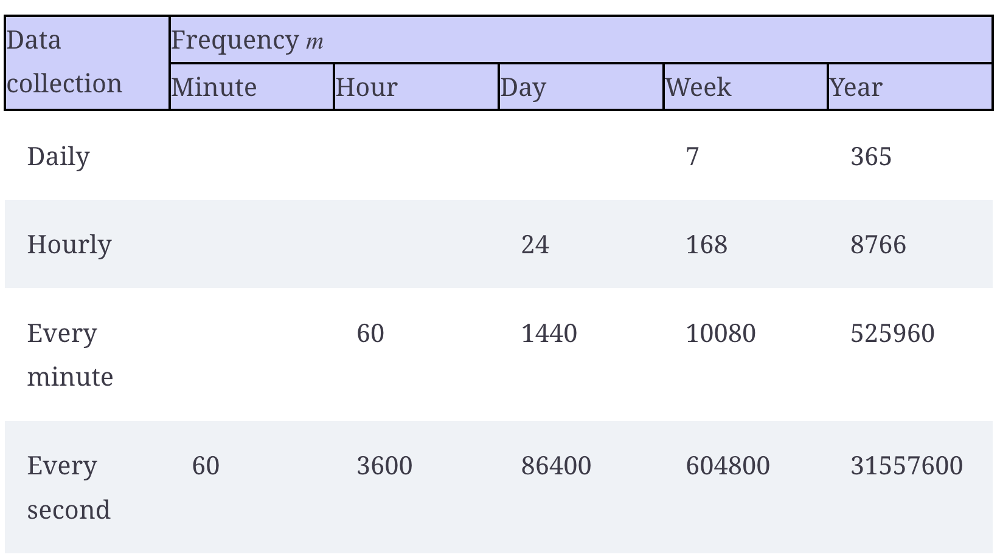

# Seasonal Autoregressive Integrated Moving Average (SARIMA) Model

- SARIMA(p,d,q)(P,D,Q)m model, which allows us to model **non-stationary** **seasonal** time series.
- The **seasonal** autoregressive integrated moving average (SARIMA) model, or $SARIMA(p,d,q)(P,D,Q)_m$ expands on $ARIMA(p,d,q)$ model by four new parameters in the model: $P$, $D$, $Q$, and $m$ to take into account **periodic** patterns when forecasting a time series
  - $m$ stands for the frequency which is the number of observations per cycle
    - If the data is every year (1 observation per year), then m=1
    - If data is collected every quarter (4 observations per year), then m = 4.
    - If the data is collected every month, then m = 12.
    - If the data is collected every week, then m = 52.
    - Note: If the data is collected on a **daily** or **sub-daily** basis, there are multiple ways of interpreting the frequency. (Please refer the "Appropriate frequency m for daily and sub-daily data" for more details)
      - It could be the frequency m = 7 as there would be seven observations in a full cycle of 1 week.
      - It could be the frequency m = 5 if the data is only collected on weekend day.
      - It could also have a yearly seasonality, meaning that m = 365.
  - $P$ is the order of the **seasonal AR(P)** process
  - $D$ is the **seasonal order** of integration: a seasonal difference makes the series stationary
  - $Q$ is the order of the **seasonal MA(Q)** process
- **Time series decomposition** can be used to identify seasonal patterns in a time series.
- **Forecasting with ARIMA**:
  - **Step 0**: deterime $m$ and perform _time series decomposition_ to identify seasonal patterns
  - **Step 1**: Check for stationarity and apply transformation in order to set the parameter $d$ & $D$ (seasonal difference)
  - **Step 2**: train-test split & prepare the baseline model
  - **Step 3**: Model selection with AIC to determine $p$, $q$, $P$ and $Q$
    - Note: The implementation of SARIMA in statsmodels simply uses $s$ instead of $m$ — they both denote the frequency.
  - **Step 4**: Forecasting
    - We apply the rolling forecast to get the prediction which means the model will be trained up to T before making the T+1 prediction.
  - **Step 5**: Model Evaluation

## Introduction

- SARIMA(p,d,q)(P,D,Q)m model, which allows us to model **non-stationary** **seasonal** time series.
- The **seasonal** autoregressive integrated moving average (SARIMA) model, or $SARIMA(p,d,q)(P,D,Q)_m$ expands on $ARIMA(p,d,q)$ model by four new parameters in the model: $P$, $D$, $Q$, and $m$ to take into account **periodic** patterns when forecasting a time series
  - $m$ stands for the frequency which is the number of observations per cycle
    - If the data is every year (1 observation per year), then m=1
    - If data is collected every quarter (4 observations per year), then m = 4.
    - If the data is collected every month, then m = 12.
    - If the data is collected every week, then m = 52.
    - Note: If the data is collected on a **daily** or **sub-daily** basis, there are multiple ways of interpreting the frequency. (Please refer the "Appropriate frequency m for daily and sub-daily data" for more details)
      - It could be the frequency m = 7 as there would be seven observations in a full cycle of 1 week.
      - It could also have a yearly seasonality, meaning that m = 365.
  - $P$ is the order of the **seasonal AR(P)** process
  - $D$ is the **seasonal order** of integration: a seasonal difference makes the series stationary
  - $Q$ is the order of the **seasonal MA(Q)** process
- Example: For the monthly data, which means that $m=12$
  - If $P=2$, the SARIMA model includes the two past values of the series at _a lag that is a mulitple of_ $m$, which are $y_{t-1*12}$ and $y_{t-2*12}$
  - If $D=1$, this means that a seasonal difference makes the series stationary
    $$y_t'=y_t - y_{t-12}$$
  - If $Q=2$, the SARIMA model includes past error terms at lags that are _a multiple of_ $m$, which are $\epsilon_{t–1*12}$ and $\epsilon_{t–2*12}$

<p align="center"><br>Appropriate frequency m for daily and sub-daily data</p>

- **Time series decomposition** can be used to identify seasonal patterns in a time series.

## Identifying seasonal patterns in a time series

- **Time series decomposition** can be used to identify seasonal patterns in a time series.
- Time series decomposition is a statistical task that separates the time series into its three main components:
  - **Trend** component: long-term change (increase & decrease) in the time series
  - **Seasonal** component: repeated fluctuations that occur over a fixed period of time.
  - **Residuals**: the noise, express any irregularity that cannot be explained by the trend or the seasonal component.
- Using the `STL` function of `statsmodels` to decompose the time series.
  - The `period` is equal to the frequency $m$.
    - Since in the below Example 1, we have monthly data, the period is 12.

```Python
from statsmodels.tsa.seasonal import STL
# Decompose the series using the STL function.
def decompose_ts(df, period):
    decomposition = STL(df, period=period).fit()

    fig, (ax1, ax2, ax3, ax4) = plt.subplots(nrows=4, ncols=1, sharex=True, figsize=(15,8))

    ax1.plot(decomposition.observed)
    ax1.set_ylabel('Observed')

    ax2.plot(decomposition.trend)
    ax2.set_ylabel('Trend')

    ax3.plot(decomposition.seasonal)
    ax3.set_ylabel('Seasonal')

    ax4.plot(decomposition.resid)
    ax4.set_ylabel('Residuals')

    fig.autofmt_xdate()
    plt.tight_layout()
```

- **Example 1**: a time-series with seasonal pattern

```Python
# load & review the data
df = pd.read_csv("../../data/book-time-series-forecasting-in-python/air-passengers.csv")
df.head()
```

<p align="center"></p>

- From the plot, there is a repeating pattern every year, with
  - A high number of passengers being recorded during June, July, and August of each year
  - Fewer passengers in November, December, and January of each year.

```Python
# The period is equal to the frequency m. Since we have monthly data, the period is 12.
decompose_ts(df['Passengers'], period=12)
```

<p align="center"><br>The decompose plots of the time series</p>

- The first plot shows the observed data.
- The second plot shows the trend component, which tells us that the number of air passengers is increasing over time.
- The third plot displays the seasonal component, and we can clearly see a repeating pattern through time.
- The last plot shows the residuals, which are variations in the data that cannot be explained by the trend or the seasonal component.

## Forecasting with SARIMA

- **Step 1**: Check for stationarity and apply transformation in order to set the parameter $d$ & $D$

```Python
def check_stationarity(series, p_significant=0.05):
    # Copied from https://machinelearningmastery.com/time-series-data-stationary-python/

    adfuller_result = adfuller(series)
    kpss_result = kpss(series)

    print(f'ADF Statistic : {adfuller_result[0]:.5f}, p-value: {adfuller_result[1]:.5f}')
    print('Critical Values:')
    for key, value in adfuller_result[4].items():
        print('\t%s: %.3f' % (key, value))
    print(f'KPSS Statistic: {kpss_result[0]:.5f}, p-value: {kpss_result[1]:.5f}')
    if (adfuller_result[1] <= p_significant) & (adfuller_result[4]['5%'] > adfuller_result[0]) & (kpss_result[1] > p_significant):
        print("\u001b[32mStationary\u001b[0m")
    else:
        print("\x1b[31mNon-stationary\x1b[0m")

check_stationarity(df["Passengers"])
# The time series is not stationary.
# Apply a transformation to our data in order to make it stationary. Let’s apply a first-order differencing using numpy.
df_diff = np.diff(df["Passengers"], n=1)
check_stationarity(df_diff)
```

- Since the series is still not stationary. Let's try the seasonal differencing on top of **first differencing** $d=1$
- Seasonal differencing:
  - since we have monthly data, m = 12, so the seasonal difference is the difference between two values that are 12 timesteps apart.

```Python
# as the first order difference of the series is not stationary
# we apply the seasonal difference on top of the first order difference of the serie
df_diff_seasonal_diff = np.diff(df_diff, n=12)
check_stationarity(df_diff_seasonal_diff) # Stationary
```

- Since the series also stationary after 1 rounds of seasonal differencing, so we set $d=1$ and $D=1$
- **Step 2**: train-test split & prepare the baseline model

```Python
# train-test split
# test set: using the last 12 months of the data as the test set
train = df['Passengers'][:-12]
test = df.iloc[-12:]

# baseline model: naive seasonal forecast, where we simply use the number of air passengers for each month of 1959 as a forecast for each month of 1960.
test['naive_seasonal'] = df['Passengers'].iloc[120:132].values
```

- **Step 3**: Model selection with AIC to determine $p$, $q$, $P$ and $Q$
  - Note: The implementation of SARIMA in statsmodels simply uses $s$ instead of $m$ — they both denote the frequency.

```Python
def optimize_SARIMA(endog: Union[pd.Series, list], order_list: list, d: int, D: int, s: int) -> pd.DataFrame:

    results = []

    for order in tqdm(order_list):
        try:
            model = SARIMAX(
                endog,
                order=(order[0], d, order[1]),
                seasonal_order=(order[2], D, order[3], s),
                simple_differencing=False).fit(disp=False)
        except:
            continue

        aic = model.aic
        results.append([order, aic])

    result_df = pd.DataFrame(results)
    result_df.columns = ['(p,q,P,Q)', 'AIC']

    #Sort in ascending order, lower AIC is better
    result_df = result_df.sort_values(by='AIC', ascending=True).reset_index(drop=True)

    return result_df
```

- List down the combination of $p$, $q$, $P$ and $Q$

```Python
# Case 2: modeling with SARIMA
ps = range(0, 4, 1)
qs = range(0, 4, 1)
Ps = range(0, 4, 1)
Qs = range(0, 4, 1)

SARIMA_order_list = list(product(ps, qs, Ps, Qs))

d = 1
D = 1
s = 12

SARIMA_result_df = optimize_SARIMA(train, SARIMA_order_list, d, D, s)

# 	(p,q,P,Q)	       AIC
# 0	(2, 1, 1, 2)	892.160317
# 1	(2, 2, 2, 1)	893.172929
# 2	(3, 2, 1, 2)	893.406954
```

- The $SARIMA(2,1,1)(1,1,2)_{12}$ model has the lowest AIC, which is a value of 892.16.
- Perform the residual analysis on the champion model

```Python
# perform residual analysis on SARIMA(2,2,2)(1,1,2)_{12}
SARIMA_model = SARIMAX(train,
                       order=(2,1,1), # p,d,q
                       seasonal_order=(1,1,2,12), # P, D, Q, S (or M)
                       simple_differencing=False)
SARIMA_model_fit = SARIMA_model.fit(disp=False)

SARIMA_model_fit.plot_diagnostics(figsize=(15,8));
```

- From the Q-Q plots, the results show that the residuals’ distribution is very close to a normal distribution.

```Python
residuals = SARIMA_model_fit.resid
jb_df = acorr_ljungbox(residuals, np.arange(1, 11, 1))
(jb_df["lb_pvalue"] >= 0.05).sum() == 10 # this to ensure all the lags, the p-value exceed 0.05, so we cannot reject the null hypo
```

- The returned p-values are all greater than 0.05. Therefore, we do not reject the null hypothesis, and we conclude that the residuals are independent and uncorrelated, just like white noise.
- Our model has passed all the tests from the residuals analysis, and we are ready to use it for forecasting.
- **Step 4**: Forecasting
  - We apply the rolling forecast to get the prediction which means the model will be trained up to T before making the T+1 prediction.

```Python
def rolling_forecast(df: pd.DataFrame,
                     train_len: int,
                     horizon: int,
                     window: int,
                     order: Tuple[int, int, int],
                     seasonal_order: Tuple[int, int, int, int]) -> list:
    total_len = train_len + horizon
    pred = []

    for i in range(train_len, total_len, window):
        model = SARIMAX(df[:i],
                        order=order,
                        seasonal_order=seasonal_order,
                        simple_differencing=False
        )
        res = model.fit(disp=False)
        predictions = res.get_prediction(0, i + window - 1)  # get prediction from timestep 0 to 80+2-1 (if window=2)
        oos_pred = predictions.predicted_mean.iloc[-window:] # get only the prediction  [-2:]
        pred.extend(oos_pred)

    return pred

TRAIN_LEN = len(train)
HORIZON = len(test)
WINDOW = 1 # 1 steps at the time for the prediction
SARIMA_pred_rolling = rolling_forecast(df['Passengers'], TRAIN_LEN, HORIZON, WINDOW,(2,1,1), (1,1,2,12))
test['SARIMA_pred_rolling'] = SARIMA_pred_rolling
```

- **Step 5**: Measure the performance of SARIMA vs Baseline models

```Python
def mape(y_true, y_pred):
    return np.mean(np.abs((y_true - y_pred) / y_true)) * 100
mape_naive_seasonal = mape(test['Passengers'], test['naive_seasonal'])
mape_SARIMA_rolling = mape(test['Passengers'], test['SARIMA_pred_rolling'])

print(mape_naive_seasonal, mape_SARIMA_rolling)
9.987532920823485 3.093198158963915
```
