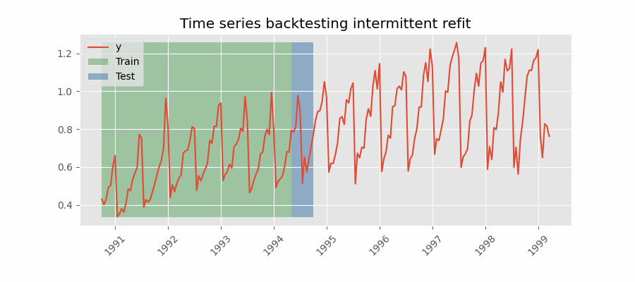

# Time Series Forecasting

## Multi-Step Time Series Forecasting

- Common Goal: to predict
  - The next element in the series $(t+1)$.
  - The whole future interval ($(t+1),...,(t+n))$.
  - The far point in time $(t+n)$.

## Backtesting

- `Backtesting` (also known as hindcasting or **time series cross-validation**) is a set of validation approaches designed to meet the specific requirements of time series.
- Similar to cross-validation, the goal of backtesting is to obtain a reliable estimate of a model’s performance after being deployed.

### Backtesting Methods

#### Backtesting with refit and increasing training size (fixed origin)

- The model is trained each time before making predictions. With this configuration, the model uses all the data available so far.

<p align="center"></p>

- Implementation of backtesting with Scikit-learn's `TimeSeriesSplit`, by default, number of splits will be 5

```Python
from sklearn.model_selection import TimeSeriesSplit
X = np.random.randn(12, 2)
y = np.random.randint(0, 2, 12)

tscv = TimeSeriesSplit() # default n_splits=5

print(tscv)
# TimeSeriesSplit(gap=0, max_train_size=None, n_splits=5, test_size=None)

for i, (train_index, test_index) in enumerate(tscv.split(X)):
    print(f"Fold {i}:")
    print(f" Train: index={train_index}")
    print(f" Test: index={test_index}")
"""
Fold 0:
  Train: index=[0]
  Test:  index=[1]
Fold 1:
  Train: index=[0 1]
  Test:  index=[2]
Fold 2:
  Train: index=[0 1 2]
  Test:  index=[3]
Fold 3:
  Train: index=[0 1 2 3]
  Test:  index=[4]
Fold 4:
  Train: index=[0 1 2 3 4]
  Test:  index=[5]
"""
```

- You can increase the `test_size`

```Python
tscv = TimeSeriesSplit(n_splits=3, test_size=2)
"""
Fold 0:
  Train: index=[0 1 2 3 4 5]
  Test:  index=[6 7]
Fold 1:
  Train: index=[0 1 2 3 4 5 6 7]
  Test:  index=[8 9]
Fold 2:
  Train: index=[0 1 2 3 4 5 6 7 8 9]
  Test:  index=[10 11]
"""
```

#### Backtesting with refit and fixed training size (rolling origin)

- A technique similar to the previous one but, in this case, the forecast origin rolls forward, therefore, the size of training remains constant.
- This is also known as **time series cross-validation** or **walk-forward validation**.

<p align="center"></p>

#### Backtesting with intermittent refit

- The model is retrained every $n$ iterations of predictions.
- This strategy usually achieves a good balance between the computational cost of retraining and avoiding model degradation.

<p align="center"></p>

#### Backtesting without refit

- This strategy has the advantage of being much faster since the model is trained only once.
- However, the model does not incorporate the latest data available, so it may lose predictive capacity over time.

<p align="center"></p>

### Backtesting with `Scikit-learn`

```Python
from sklearn.model_selection import TimeSeriesSplit
from sklearn.model_selection import cross_val_score
from sklearn.ensemble import RandomForestRegressor

# Assuming X and y are your feature matrix and target variable
tscv = TimeSeriesSplit(n_splits=5)

# Instantiate your model (e.g., RandomForestRegressor)
model = RandomForestRegressor()

# Perform cross-validation
cv_scores = cross_val_score(model, X, y, cv=tscv, scoring='r2')
```
